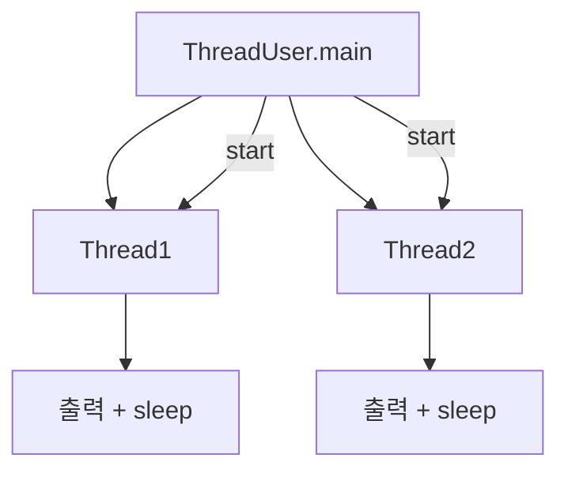
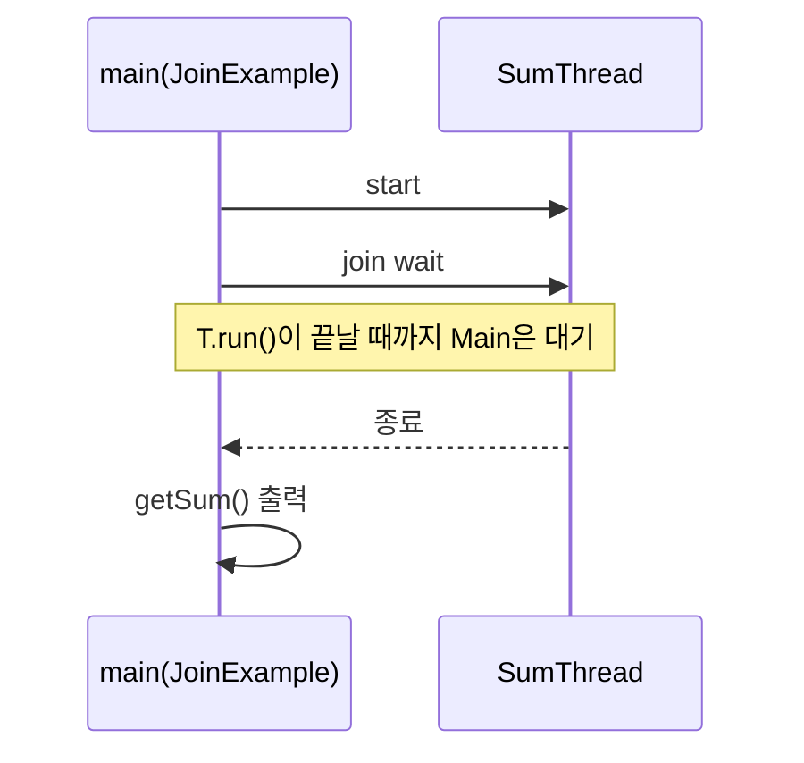
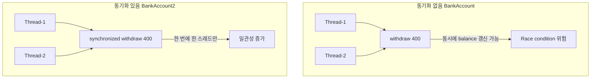
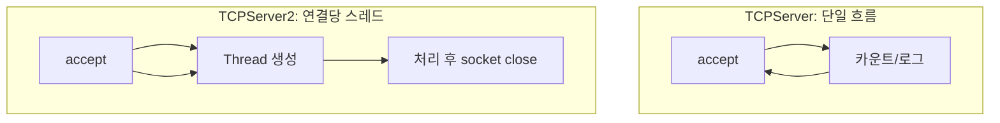
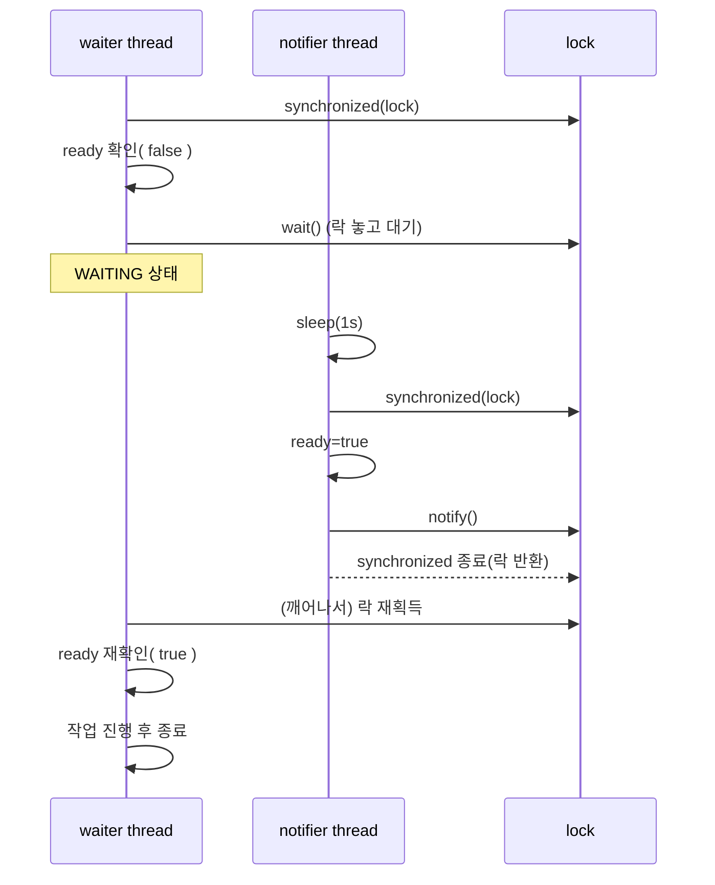

<br>


# ☕ Java Basic Learning - Day 9(thread)

자바 **스레드(Thread)** 기초와 **TCP 소켓 서버/클라이언트**에서의 동시성 처리 흐름을 예제로 정리한 프로젝트입니다.

---

## 핵심 개념 한 장 요약

- **Thread 생성/실행**
  - `Thread`를 상속해 `run()`에 동작을 작성하고, `start()`로 실행합니다.
  - `run()`을 직접 호출하면 “그냥 메서드 호출”이고, `start()`가 진짜 멀티스레드 실행을 시작합니다.
- **sleep / InterruptedException**
  - `Thread.sleep(ms)`는 현재 스레드를 잠깐 멈춥니다.
  - 외부 요인으로 중단될 수 있어 `InterruptedException` 처리가 필요합니다.
- **join**
  - `join()`은 **대상 스레드가 끝날 때까지 현재 스레드가 대기**합니다.
  - “결과가 계산될 때까지 기다려야 하는 상황”에 사용합니다.
- **동기화(synchronized)**
  - 여러 스레드가 공유 데이터(예: `balance`)를 동시에 변경하면 **경쟁 상태(race condition)** 가 생깁니다.
  - `synchronized`로 임계 구역을 보호하면 한 번에 한 스레드만 접근하게 되어 일관성이 좋아집니다.
- **TCP 서버의 동시성**
  - `ServerSocket.accept()`는 클라이언트 연결이 올 때까지 블로킹됩니다.
  - 서버가 연결 처리(또는 작업)를 오래 잡고 있으면 다음 연결을 못 받으므로, **연결당 스레드** 또는 **스레드풀** 같은 구조가 필요합니다.

---

## 실행 흐름 그림(mermaid)

### 1) 기본 Thread 실행 흐름 (`ThreadUser` → `Thread1`,`Thread2`)



### 2) join으로 “끝날 때까지 기다리기” (`JoinExample` → `SumThread`)



### 3) 동기화 전/후 차이 (`SyncTest`/`SyncTest2`)



### 4) TCP 서버: 단일 처리 vs 연결당 스레드 (`TCPServer` vs `TCPServer2`)



---

## 코드 + 설명 (코드 아래에 바로 해설)

### `Thread1.java`

```java
package thread;

//1. 스레드 클래스를 만드세요. 1) 이름클래스 2) 익명클래스
public class Thread1 extends Thread{
    @Override
    public void run() {
        //동시에 처리되는 코드
        for (int i = 0; i < 10000; i++) {
            System.out.println("++ 증가: " + i);
            System.out.println("스레드 이름: " + Thread.currentThread().getName());
            try {
                Thread.sleep(1000);
            } catch (InterruptedException e) {
                System.out.println("에러정보 "  + e);
            }
        }
    }
}
```

- **핵심**: `run()` 안의 루프가 “동시에 실행”되는 작업입니다.
- **관찰**: `Thread.sleep(1000)` 때문에 1초마다 출력이 나오며, 다른 스레드 출력과 섞입니다.
- **포인트**: 실행 중인 스레드 이름은 `Thread.currentThread().getName()`으로 확인합니다.

### `Thread2.java`

```java
package thread;

//1. 스레드 클래스를 만드세요. 1) 이름클래스 2) 익명클래스
public class Thread2 extends Thread{
    @Override
    public void run() {
        //동시에 처리되는 코드
        for (int i = 10000; i > 0; i--) {
            System.out.println("-- 감소: " + i);
            //스레드 이름은 start순서에 따라 Thread1, Thread2 이렇게 자동으로 이름이 만들어짐.
            System.out.println("스레드 이름: " + Thread.currentThread().getName());
            try {
                Thread.sleep(1000);
            } catch (InterruptedException e) {
                System.out.println("에러정보 "  + e);
            }
        }
    }
}
```

- **핵심**: `Thread1`과 반대로 감소 루프를 돌며 출력합니다.
- **관찰**: 동시에 실행되므로 `Thread1`과 `Thread2`의 출력이 서로 섞여 보입니다.

### `ThreadUser.java`

```java
package thread;

public class ThreadUser {
    public static void main(String[] args) {
        //1. thread클래스를 만들자.
        //2. 객체를 만들자.
        Thread thread1 = new Thread1();
        Thread thread2 = new Thread2();
        //스레드 이름은 start순서에 따라 Thread1, Thread2 이렇게 자동으로 이름이 만들어짐.
        thread1.setName("증가 스레드"); //스레드 이름을 임의로 지정할 수 있음.
        thread2.setName("감소 스레드"); //스레드 이름을 임의로 지정할 수 있음.
        //3. cpu대기줄에 넣자.
        thread1.start();
        thread2.start();
    }
}
```

- **핵심**: `start()` 호출로 각 스레드의 `run()`이 별도 실행됩니다.
- **중요**: `start()`를 호출하는 “순서”가 실제 출력 순서를 보장하지는 않습니다(스케줄링은 JVM/OS가 결정).
- **팁**: `setName()`으로 이름을 붙이면 로그에서 어떤 스레드인지 구분하기 쉬워요.

### `SumThread.java`

```java
package thread;

public class SumThread extends Thread {
    private long sum;

    public long getSum() {
        return sum;
    }

    public void setSum(long sum) {
        this.sum = sum;
    }

    @Override
    public void run() {
        for (int i = 1; i <= 100; i++) {
            sum += i;
        }
    }
}
```

- **핵심**: 계산 결과(`sum`)가 스레드 내부에서 만들어지고, 메인 스레드는 `getSum()`으로 조회합니다.

### `JoinExample.java`

```java
package thread;

public class JoinExample {
    public static void main(String[] args) {
        SumThread sumThread = new SumThread();
        sumThread.start();
        try {
            sumThread.join();
        } catch (InterruptedException e) {
        }
        System.out.println("1~100 합: " + sumThread.getSum());
    }
}

//join은 해당 스레드가 끝날 때 까지 기다리는 기능
//join()안했을 때
//1~100 합: 0
//합을 다 구해야 프린트 가능함.
//join()넣어줬을 때
//1~100 합: 5050
```

- **핵심**: `join()` 때문에 `sumThread`가 끝나기 전에는 다음 줄(출력)로 못 넘어갑니다.
- **왜 필요?**: `join()`이 없으면 메인 스레드가 먼저 `getSum()`을 찍어 “아직 0”일 수 있습니다.

### `BankAccount.java` + `SyncTest.java` (동기화 없음)

```java
package thread;

class BankAccount extends Thread {
    private int balance = 1000;
    public void withdraw(int amount) {
        if (balance >= amount) {
            System.out.println(Thread.currentThread().getName() + " 출금 시도 중...");
            balance -= amount;
            System.out.println(Thread.currentThread().getName() + " 출금 완료. 남은 잔액: " + balance);
        } else {
            System.out.println(Thread.currentThread().getName() + " 출금 실패. 잔액 부족.");
        }
    }
    @Override
    public void run() {
        for (int i = 0; i < 3; i++) {
            withdraw(400);
        }
    }
}
```

```java
package thread;

public class SyncTest {
    public static void main(String[] args) {
        BankAccount bankAccount = new BankAccount();
        Thread t1 = new Thread(bankAccount);
        Thread t2 = new Thread(bankAccount);
        t1.start();
        t2.start();
    }
}
```

- **핵심**: 두 스레드가 같은 `BankAccount`(같은 `balance`)를 공유합니다.
- **문제**: 잔액 검사(`if`)와 차감(`balance -= amount`) 사이에 다른 스레드가 끼어들면 결과/로그가 기대와 다르게 보일 수 있어요(경쟁 상태).

### `BankAccount2.java` + `SyncTest2.java` (synchronized)

```java
package thread;

class BankAccount2 extends Thread {
    private int balance = 1000;
    public synchronized void withdraw(int amount) {
        if (balance >= amount) {
            System.out.println(Thread.currentThread().getName() + " 출금 시도 중...");
            balance -= amount;
            System.out.println(Thread.currentThread().getName() + " 출금 완료. 남은 잔액: " + balance);
        } else {
            System.out.println(Thread.currentThread().getName() + " 출금 실패. 잔액 부족.");
        }
    }
    @Override
    public void run() {
        for (int i = 0; i < 3; i++) {
            withdraw(400);
        }
    }
}
```

```java
package thread;

public class SyncTest2 {
    public static void main(String[] args) {
        BankAccount2 bankAccount = new BankAccount2();
        Thread t1 = new Thread(bankAccount);
        Thread t2 = new Thread(bankAccount);
        t1.start();
        t2.start();
    }
}
```

- **핵심**: `synchronized`가 붙은 `withdraw()`는 한 번에 한 스레드만 들어올 수 있습니다.
- **효과**: 공유 데이터(`balance`) 동시 접근이 줄어, 결과가 더 안정적으로 보입니다.

### `TCPServer.java` (단순 서버)

```java
package thread;

import java.net.ServerSocket;
import java.net.Socket;

public class TCPServer {
    public static void main(String[] args) throws Exception {
// Socket이 2개 필요
// 클라이언트 연결 승인용: ServerSocket
// 데이터 전송용: Socket
// 예외처리: 외부의 자원을 연결하는 경우 (db, file, net, CPU)
        ServerSocket server = new ServerSocket(9100);
        System.out.println("TCP 서버 소켓 시작됨.");
        System.out.println("클라이언트의 연결을 기다리는 중...");
        int count = 0;
        while (true) {
            Socket socket = server.accept(); // 클라이언트 연결 수락
            count++;
            System.out.println("연결된 클라이언트 수: " + count);
            System.out.println("클라이언트와 연결 성공.");
        }
    }
}
```

- **핵심**: `accept()`는 연결이 올 때까지 기다리는(블로킹) 함수입니다.
- **주의**: 이 코드는 `socket.close()`를 하지 않아서 연결이 계속 쌓일 수 있습니다(실습할 땐 횟수 줄이기 권장).

### `TCPClients.java` (단순 클라이언트)

```java
package thread;

import java.net.Socket;

public class TCPClients {
    public static void main(String[] args) throws Exception {
        for (int i = 0; i < 10000; i++) {
            Socket socket = new Socket("localhost", 9100);
            System.out.println("클라이언트 " + i + ": 서버와 연결성공!!!!");
        }
    }
}
```

- **핵심**: 클라이언트가 루프로 서버에 계속 접속합니다.
- **주의**: `socket.close()`가 없어서 소켓 자원을 많이 씁니다.

### `TCPServer2.java` (연결당 스레드)

```java
package thread;

import java.net.ServerSocket;
import java.net.Socket;

public class TCPServer2 {
    public static void main(String[] args) throws Exception {

        ServerSocket server = new ServerSocket(9100);
        System.out.println("TCP 서버 시작");

        while (true) {
            Socket socket = server.accept(); // 연결 수락

            // 👉 핵심: 스레드 생성
            new Thread(() -> {
                try {
                    System.out.println(Thread.currentThread().getName()
                            + " : 클라이언트 연결됨");

                    // 간단 유지 (테스트용)
                    Thread.sleep(1000);

                    socket.close();
                } catch (Exception e) {
                    e.printStackTrace();
                }
            }).start(); // 바로 실행
        }
    }
}
```

- **핵심**: 연결이 들어올 때마다 새 스레드를 만들어 그 스레드가 처리합니다.
- **효과**: 메인 스레드는 다음 연결을 계속 받을 수 있습니다.

### `TCPClients2.java` (클라이언트도 스레드로 동시 접속)

```java
package thread;

import java.net.Socket;

public class TCPClients2 {
    public static void main(String[] args) {

        for (int i = 0; i < 1000; i++) {
            int clientNo = i;

            new Thread(() -> {
                try {
                    Socket socket = new Socket("localhost", 9100);
                    System.out.println("클라이언트 " + clientNo + ": 서버와 연결성공!!!!");
                    socket.close();
                } catch (Exception e) {
                    e.printStackTrace();
                }
            }).start();
        }
    }
}
```

- **핵심**: 클라이언트도 스레드를 사용해 동시에 접속을 만듭니다.
- **주의**: 스레드를 너무 많이 만들면 PC가 느려질 수 있습니다.

---

## 추가된 예제 코드 정리 (wait/notify, properties, Swing 멀티스레드)

### 5) `WaitExample.java` (wait/notify로 “조건이 될 때까지 대기”)

```java
package thread;

public class WaitExample {
    private static final Object lock = new Object();
    private static boolean ready = false;

    public static void main(String[] args) throws Exception {
        Thread waiter = new Thread(() -> {
            synchronized (lock) {
                while (!ready) {
                    try {
                        System.out.println("waiter: ready=false, wait()로 대기");
                        lock.wait(); // notify/notifyAll 될 때까지 대기
                    } catch (InterruptedException e) {
                        return;
                    }
                }
                System.out.println("waiter: 깨어남! ready=true, 작업 진행");
            }
        });

        Thread notifier = new Thread(() -> {
            try {
                Thread.sleep(1000);
            } catch (InterruptedException ignored) {
            }

            synchronized (lock) {
                ready = true;
                System.out.println("notifier: ready=true, notify()");
                lock.notify(); // 대기 중인 스레드 1개 깨움
            }
        });

        waiter.start();
        notifier.start();

        waiter.join();
        notifier.join();
        System.out.println("main: 종료");
    }
}
```

- **핵심**: `wait()`는 **락을 잡고(synchronized 안에서)** 호출해야 하며, 호출 순간 **락을 놓고 대기 상태**로 들어갑니다.
- **핵심**: `notify()`/`notifyAll()`도 **같은 락을 잡고(synchronized 안에서)** 호출해야 합니다.
- **왜 while?**: `wait()`는 “가끔 이유 없이 깨어나는 것처럼 보일 수(spurious wakeup)” 있어서, `if`보다 `while(조건 체크)`가 안전합니다.



---

### 6) `PropertiesExample.java` + `database.properties` (설정 파일 읽기)

```java
package thread;

import java.util.Properties;

public class PropertiesExample {
    public static void main(String[] args) throws Exception {
        Properties properties = new Properties();
        properties.load(PropertiesExample.class.getResourceAsStream("database.properties"));

        String driver = properties.getProperty("driver");
        String url = properties.getProperty("url");
        String username = properties.getProperty("username");
        String password = properties.getProperty("password");
        String admin = properties.getProperty("admin");

        System.out.println("driver : " + driver);
        System.out.println("url : " + url);
        System.out.println("username : " + username);
        System.out.println("password : " + password);
        System.out.println("admin : " + admin);
    }
}
```

```properties
driver=oracle.jdbc.OracleDirver
url=jdbc:oracle:thin:@localhost:1521:orcl
username=scott
password=tiger
admin=홍길동
```

- **핵심**: `Properties`는 `key=value` 설정을 읽는 표준 컬렉션입니다.
- **핵심**: `getResourceAsStream("database.properties")`는 **`PropertiesExample`과 같은 패키지/경로**에 있는 리소스를 읽습니다. (여기서는 `src/thread/database.properties`)
- **주의**: `admin` 같은 한글은 저장 방식에 따라 유니코드 이스케이프(`\uXXXX`)로 보일 수 있습니다. 출력은 정상적으로 한글로 찍히는 경우가 많습니다.

```mermaid
flowchart LR
  A[PropertiesExample] --> B[getResourceAsStream]
  B --> C[(database.properties)]
  C --> D[Properties.load]
  D --> E[getProperty(key)]
  E --> F[콘솔 출력]
```

---

### 7) `ThreadRun.java` (Swing UI에서 “서로 다른 작업을 스레드로 동시에”)

- **구성**: `JFrame` 화면에 3개의 라벨(`top`, `center`, `sub`)을 배치하고,
  - **counter 스레드**: 숫자 카운트다운(1초 간격)
  - **timer 스레드**: 현재 시간 갱신(1초 간격)
  - **img 스레드**: 이미지/텍스트를 3초 간격으로 변경
  을 동시에 실행합니다.

```mermaid
flowchart TB
  UI[JFrame/Labels 생성] --> START[3개 Thread start()]
  START --> C[counter: top 변경]
  START --> T[timer: sub 시간 변경]
  START --> I[img: center 이미지/텍스트 변경]
  C --> S1[sleep 1s]
  T --> S2[sleep 1s]
  I --> S3[sleep 3s]
```

- **주의(중요)**: Swing은 원칙적으로 **EDT(Event Dispatch Thread)** 에서 UI를 업데이트하는 것이 안전합니다.  
  실습에서는 동작 확인이 가능하지만, 실무/안정성 관점에서는 `SwingUtilities.invokeLater(...)`로 라벨 변경 코드를 EDT로 보내는 방식이 권장됩니다.

## 어떻게 실행하나요?

### IntelliJ IDEA 기준
- `dyay9-thread/src/thread`의 각 클래스에 `main`이 있는 파일을 선택해서 실행합니다.
  - Thread 예제: `ThreadUser`
  - join 예제: `JoinExample`
  - 동기화 예제: `SyncTest`, `SyncTest2`
  - TCP 예제: 먼저 `TCPServer` 또는 `TCPServer2` 실행 → 그 다음 `TCPClients` 또는 `TCPClients2` 실행

---


<br>


<br>

```

package test;


import javax.swing.*;
import java.awt.BorderLayout;
import java.awt.Font;
import java.awt.Color;
import java.util.Date;

public class ThreadRun extends JFrame {
    JLabel top = new JLabel("1"); //전역변수, 글로벌변수
    JLabel center = new JLabel("2");
    JLabel sub = new JLabel("3");

    public ThreadRun() {
        getContentPane().setBackground(Color.GREEN);
        setTitle("나의 멀티스레드");
        setSize(875, 360);

        top.setFont(new Font("Arial Narrow", Font.BOLD, 65));
        getContentPane().add(top, BorderLayout.NORTH);

        center.setFont(new Font("굴림", Font.PLAIN, 54));
        getContentPane().add(center, BorderLayout.CENTER);

        sub.setFont(new Font("Arial Narrow", Font.BOLD, 50));
        getContentPane().add(sub, BorderLayout.SOUTH);

        JLabel lblNewLabel = new JLabel("New label");
        lblNewLabel.setForeground(Color.GREEN);
        lblNewLabel.setFont(new Font("굴림", Font.BOLD, 35));
        getContentPane().add(lblNewLabel, BorderLayout.WEST);

        JLabel lblNewLabel_1 = new JLabel("New label");
        lblNewLabel_1.setForeground(Color.GREEN);
        lblNewLabel_1.setFont(new Font("굴림", Font.BOLD, 35));
        getContentPane().add(lblNewLabel_1, BorderLayout.EAST);

        Thread counter = new Thread(){
            @Override
            public void run() {
                for (int i = 500; i > 0; i--) {
                    top.setText("Counter: " + i);
                    System.out.println("현재 thread이름 : " + getName());
                    try {
                        Thread.sleep(500);
                    } catch (InterruptedException e) {
                        e.printStackTrace();
                    }
                }
            }
        };
        Thread timer = new Thread(){
            @Override
            public void run() {
                for (int i = 0; i < 300; i++) {
                    Date date = new Date();
                    sub.setText(String.valueOf(date));
                    System.out.println("현재 thread이름 : " + getName());
                    try {
                        Thread.sleep(1000);
                    } catch (InterruptedException e) {
                        e.printStackTrace();
                    }
                }
            }
        };
        Thread img = new Thread(){
            @Override
            public void run() {
                String[] img = {"1.png", "2.png", "3.png", "4.png", "5.png"};
                for (int i = 0; i < img.length; i++) {
                    //center.setText("이미지: " + img[i]);
                    ImageIcon icon = new ImageIcon(img[i]);
                    center.setIcon(icon);
                    System.out.println("현재 thread이름 : " + getName());
                    try {
                        Thread.sleep(3000);
                    } catch (InterruptedException e) {
                        e.printStackTrace();
                    }
                }
            }
        };

        counter.start();
        timer.start();
        img.start();


        setVisible(true);
    }

    public static void main(String[] args) {
        ThreadRun t = new ThreadRun();
    }
}


```
