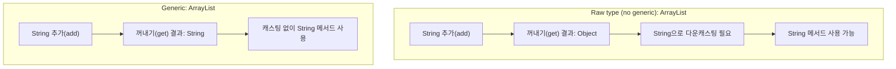
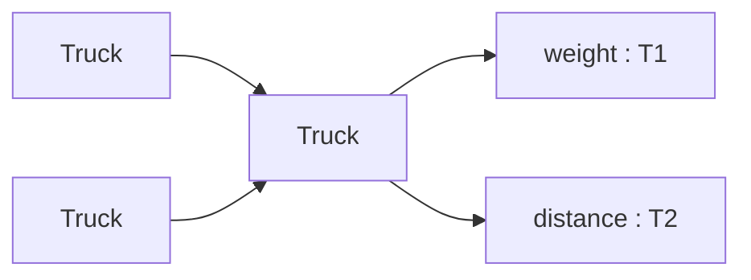
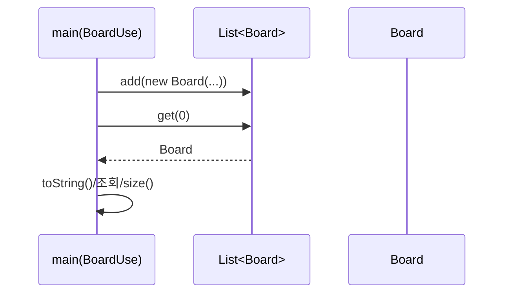

<br>


<br>

# ☕ Java Basic Learning - Day 10 (Generic / Collection)

Day10은 **제네릭(Generic)** 을 왜 쓰는지(타입 안정성, 형변환 제거)와,  
자주 쓰는 **컬렉션(ArrayList / List)** 에 제네릭을 적용해서 객체를 안전하게 다루는 예제를 정리한 프로젝트입니다.

---

## 핵심 개념 한 장 요약

- **Raw type(제네릭 미사용)**: `ArrayList list = new ArrayList();`
  - 내부 요소 타입이 `Object`로 취급되어 **꺼낼 때 다운캐스팅**이 필요합니다.
  - 잘못된 타입이 섞여도 컴파일 시점에 못 잡아 **런타임 오류**가 날 수 있습니다.
- **Generic(제네릭 사용)**: `ArrayList<String> list = new ArrayList<>();`
  - 컴파일러가 타입을 보장해줘서 **불필요한 형변환이 사라지고**, 잘못된 타입은 **컴파일 에러**로 잡힙니다.
- **사용자 정의 제네릭 클래스**: `class Truck<T1, T2>`
  - 클래스가 다루는 타입을 외부에서 결정하게 해서 재사용성이 좋아집니다.
- **컬렉션 + 도메인 객체**: `List<Board> list = new ArrayList<>();`
  - `Board` 같은 객체를 리스트에 모아 안전하게 관리/조회할 수 있습니다.

---

## 실행 흐름 그림(mermaid)

### 1) Raw type vs Generic 차이



### 2) 사용자 정의 제네릭 클래스 사용 (`Truck<T1,T2>`)



### 3) 컬렉션에 객체 담기 (`List<Board>`)



---

## 코드 + 설명 (코드 아래에 바로 해설)

### `GenericTest.java` (제네릭 미사용: Raw type)

```java
package generic;

import java.util.ArrayList;

public class GenericTest {
    public static void main(String[] args) {
        ArrayList list = new ArrayList();
        list.add("홍길동");
        list.add("홍길동");
        list.add("김길동");
        System.out.println(list);
        System.out.println(list.size());
        System.out.println(list.get(0));
        System.out.println(list.get(0).equals("홍길동"));
        System.out.println(((String)(list.get(0))).charAt(0));
    }
}
```

- **핵심**: `list.get(0)`의 타입은 `Object`라서, `charAt()` 같은 `String` 메서드를 쓰려면
  - `((String) list.get(0))` 처럼 **다운캐스팅**이 필요합니다.
- **주의**: 나중에 다른 타입이 섞이면(예: `list.add(100)`) 컴파일은 되지만, 꺼낼 때 캐스팅에서 **ClassCastException**이 날 수 있어요.

---

### `GenericTest2.java` (제네릭 사용: 타입 안정성 + 형변환 제거)

```java
package generic;

import java.util.ArrayList;

public class GenericTest2 {
    public static void main(String[] args) {
        ArrayList<String> list = new ArrayList<>();
        list.add("홍길동");
        list.add("홍길동");
        list.add("김길동");
        System.out.println(list.get(0).charAt(0));

        ArrayList<Integer> list2 = new ArrayList<>();
        list2.add(100);
        list2.add(200);
        System.out.println(list2.get(0).intValue());
    }
}
```

- **핵심**: `ArrayList<String>`이면 `get()` 결과가 `String`으로 확정되어 **캐스팅 없이** 바로 `charAt()`을 호출할 수 있습니다.
- **핵심**: `ArrayList<Integer>`처럼 Wrapper 타입도 제네릭으로 지정할 수 있습니다(기본형 `int`는 직접 못 들어가요).

---

### `Truck.java` (사용자 정의 제네릭 클래스)

```java
package generic;

public class Truck <T1, T2>{
    T1 weight;
    T2 distance;

    public Truck() {
    }

    public Truck(T1 weight, T2 distance) {
        this.weight = weight;
        this.distance = distance;
    }

    public T1 getWeight() {
        return weight;
    }

    public void setWeight(T1 weight) {
        this.weight = weight;
    }

    public T2 getDistance() {
        return distance;
    }

    public void setDistance(T2 distance) {
        this.distance = distance;
    }

    @Override
    public String toString() {
        return "Truck{" +
                "weight=" + weight +
                ", distance=" + distance +
                '}';
    }
}
```

- **핵심**: `T1`, `T2`는 “아직 정해지지 않은 타입”이고, 객체를 만들 때 타입이 결정됩니다.
- **장점**: 같은 `Truck` 클래스를 **서로 다른 타입 조합**으로 재사용할 수 있어요.

---

### `TruckUse.java` (제네릭 타입 파라미터로 Truck 사용하기)

```java
package generic;

public class TruckUse {
    public static void main(String[] args) {
        Truck<String, Integer> truck = new Truck<>();
        truck.weight = "heavy";
        truck.distance = 100;
        System.out.println(truck);

        Truck<Integer, Integer> truck2 = new Truck<>(100, 200);
        System.out.println(truck2);
    }
}
```

- **핵심**: `Truck<String, Integer>`는
  - `weight`는 `String`, `distance`는 `Integer`로 고정됩니다.
- **팁**: 실무에서는 보통 `weight`, `distance` 같은 필드는 `private`로 두고 getter/setter로 접근하는 방식이 더 안전합니다.

---

### `Board.java` + `BoardUse.java` (컬렉션에 객체 담기)

```java
package collection;

public class Board {
    private String subject;
    private String content;
    private String writer;

    public Board(String subject, String content, String writer) {
        this.subject = subject;
        this.content = content;
        this.writer = writer;
    }

    public String getSubject() { return subject; }
    public void setSubject(String subject) { this.subject = subject; }
    public String getContent() { return content; }
    public void setContent(String content) { this.content = content; }
    public String getWriter() { return writer; }
    public void setWriter(String writer) { this.writer = writer; }

    @Override
    public String toString() {
        return "Board{" +
                "subject='" + subject + '\'' +
                ", content='" + content + '\'' +
                ", writer='" + writer + '\'' +
                '}';
    }
}
```

```java
package collection;

import java.util.ArrayList;
import java.util.List;

public class BoardUse {
    public static void main(String[] args) {
        List<Board> list = new ArrayList<>();
        list.add(new Board("홍", "펀", "hong"));
        list.add(new Board("홍2", "펀", "hong"));
        list.add(new Board("홍3", "펀", "hong"));
        list.add(new Board("홍4", "펀", "hong"));
        list.add(new Board("홍5", "펀", "hong"));

        System.out.println(list);
        System.out.println(list.get(0));
        System.out.println(list.size());
    }
}
```

- **핵심**: `List<Board>`로 선언하면, 리스트 안에는 **Board만 들어갈 수 있고** `get()`도 `Board`로 바로 받습니다.
- **관찰**: `System.out.println(list)`는 내부적으로 각 요소의 `toString()`을 호출해서 전체가 출력됩니다.

---

## 어떻게 실행하나요?

### IntelliJ IDEA 기준
- `day10-generic/src/generic` 실행
  - Raw type 예제: `GenericTest`
  - Generic 예제: `GenericTest2`
  - 사용자 정의 제네릭: `TruckUse`
- `day10-generic/src/collection` 실행
  - 컬렉션 + 객체: `BoardUse`

<br>
<hr>
<br>


