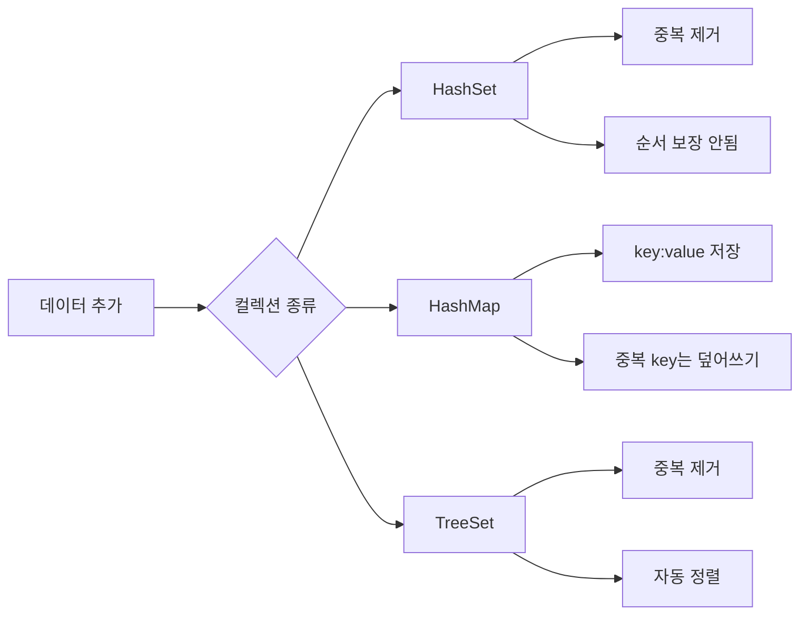
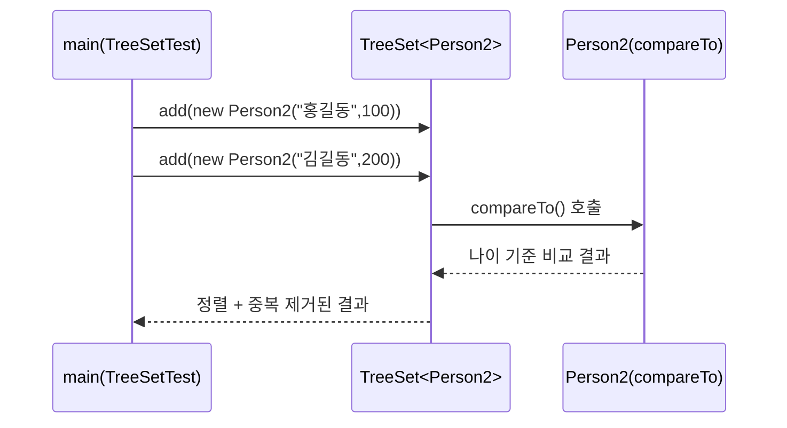
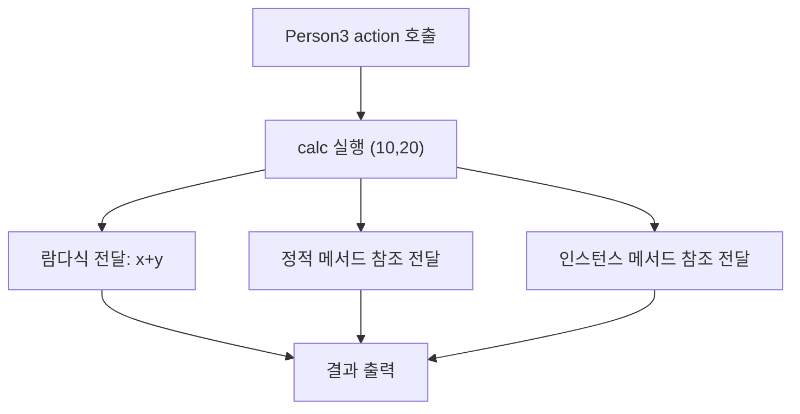

<br>


<br>

# ☕ Java Basic Learning - Day 11 (Collection / Lambda / Properties)

Day11은 컬렉션 프레임워크에서 자주 사용하는 **Set / Map / TreeSet**과,  
함수형 인터페이스 기반의 **람다식 + 메서드 참조**, 그리고 설정 파일 로딩용 **Properties**를 함께 정리한 프로젝트입니다.

---

## 핵심 개념 한 장 요약

- **HashSet**
  - 중복을 허용하지 않고, 저장 순서를 보장하지 않습니다.
  - 인덱스가 없기 때문에 `Iterator` 또는 `for-each`로 순회합니다.
- **HashMap**
  - `key:value` 구조로 데이터를 저장하고, 키는 중복될 수 없습니다.
  - 같은 키를 `put()`하면 기존 값이 덮어써집니다.
- **TreeSet**
  - 중복 제거 + 정렬을 동시에 수행합니다.
  - 사용자 정의 객체를 넣으려면 정렬 기준(`Comparable` 또는 `Comparator`)이 필요합니다.
- **Lambda + Method Reference**
  - 함수형 인터페이스(`@FunctionalInterface`)를 대상으로 람다식과 `Class::method` 문법을 사용할 수 있습니다.
- **Properties**
  - `.properties` 파일에서 키-값 설정을 읽어 애플리케이션 설정값을 분리 관리할 수 있습니다.

---

## 실행 흐름 그림(mermaid)

### 1) Set / Map / TreeSet 동작 흐름



### 2) TreeSet + 사용자 정의 객체 정렬



### 3) Lambda / Method Reference 실행 흐름



---

## 코드 + 설명 (코드 아래에 바로 해설)

### `HashSetTest.java` (중복 제거, 순회 방법)

```java
package collection;

import java.util.HashSet;
import java.util.Iterator;
import java.util.Set;

public class HashSetTest {
    public static void main(String[] args) {
        // String 타입의 제네릭 Set 객체 생성 (순서 보장 안됨, 중복 제거)
        Set<String> set = new HashSet<>();
        
        // Set에 문자열 추가
        set.add("Java");
        set.add("JDBC");
        set.add("JSP");
        set.add("Spring");
        set.add("Spring");  // 중복 요소: 두 번째는 추가되지 않음

        // Set 전체 출력 (순서는 보장되지 않고 중복 제거됨)
        System.out.println(set);  // [Spring, Java, JSP, JDBC] 또는 다른 순서
        
        // Set의 크기 출력 (중복 제거되었으므로 4)
        System.out.println(set.size());  // 4

        // 방법 1: Iterator를 사용한 순회
        Iterator<String> iterator = set.iterator();
        while (iterator.hasNext()){
            String e = iterator.next();  // 다음 요소 가져오기
            System.out.println("꺼낸 값은 " + e);
        }

        // Set에서 특정 요소 제거
        set.remove("JDBC");
        System.out.println(set);  // 제거된 상태 출력
        System.out.println(set.size());  // 3

        // 방법 2: for-each를 사용한 순회 (더 간단함)
        for (String s : set){
            System.out.println(s);
        }
    }
}
```

- `Set`은 중복을 허용하지 않으므로 `"Spring"`은 한 번만 유지됩니다.
- `Set`에는 인덱스가 없어서 `get(0)` 같은 접근이 불가능합니다.
- 순회는 `Iterator` 또는 `for-each`를 사용합니다.

---

### `HashMapTest.java` (key:value 저장, keySet/entrySet 순회)

```java
package collection;

import java.util.HashMap;
import java.util.Iterator;
import java.util.Map;
import java.util.Map.Entry;
import java.util.Set;

public class HashMapTest {
    public static void main(String[] args) {
        // String key, Integer value를 가진 HashMap 생성
        Map<String, Integer> map = new HashMap<>();
        
        // key:value 쌍을 Map에 추가
        map.put("홍길동", 85);
        map.put("김길동", 85);
        map.put("송길동", 85);
        map.put("송길동", 90);  // 같은 key로 다시 put하면 값이 덮어써짐 (85 -> 90)
        
        // Map 전체 출력
        System.out.println(map);  // {홍길동=85, 김길동=85, 송길동=90}
        
        // Map의 크기 (key의 개수)
        System.out.println(map.size());  // 3
        
        // 특정 key로 value 조회
        System.out.println(map.get("홍길동"));  // 85

        // 방법 1: keySet()을 사용한 순회 (key만 필요할 때)
        Set<String> keys = map.keySet();  // 모든 key를 Set으로 반환
        Iterator<String> iterator = keys.iterator();
        while(iterator.hasNext()){
            String key = iterator.next();  // key 가져오기
            System.out.println(key + ":" + map.get(key));  // key로 value 조회
        }

        // 방법 2: entrySet()을 사용한 순회 (key와 value를 함께 처리할 때, 더 효율적)
        Set<Entry<String, Integer>> entrySet = map.entrySet();  // Map.Entry를 Set으로 반환
        Iterator<Entry<String, Integer>> iterator1 = entrySet.iterator();
        while(iterator1.hasNext()){
            Entry<String, Integer> entry = iterator1.next();  // Map.Entry 가져오기
            System.out.println(entry.getKey() + ": " + entry.getValue());  // key와 value 동시 접근
        }

        // Map에서 특정 key와 해당 value 제거
        map.remove("홍길동");
        System.out.println(map.size());  // 2
    }
}
```

- 같은 키(`"송길동"`)를 다시 넣으면 값이 **90으로 갱신(덮어쓰기)** 됩니다.
- 키만 필요할 때는 `keySet()`, 키와 값을 같이 다룰 때는 `entrySet()`이 효율적입니다.

---

### `TreeSetTest.java` + `Person2.java` (정렬 + 비교 기준)

```java
package collection;

import java.util.TreeSet;

public class TreeSetTest {
    public static void main(String[] args) {
        // String 타입의 TreeSet 생성 (자동 정렬 + 중복 제거)
        TreeSet<String> treeSet = new TreeSet<>();
        
        // 정렬 기준을 자동으로 적용 (String은 Comparable 구현)
        treeSet.add("홍길동");
        treeSet.add("김길동");
        treeSet.add("정길동");
        treeSet.add("홍길동");  // 중복이므로 추가되지 않음
        
        // 알파벳순으로 정렬되어 출력됨
        System.out.println(treeSet);  // [김길동, 정길동, 홍길동]

        // 사용자 정의 객체를 TreeSet에 넣기 (Comparable 구현 필요)
        TreeSet<Person2> treeSet2 = new TreeSet<>();
        treeSet2.add(new Person2("홍길동", 100));
        treeSet2.add(new Person2("김길동", 200));
        treeSet2.add(new Person2("홍길동", 100));  // compareTo() 기준 중복이므로 추가되지 않음
        
        // 나이 기준으로 정렬됨
        System.out.println(treeSet2);
    }
}
```

```java
package collection;

import java.util.Objects;

// TreeSet에서 사용하려면 Comparable 인터페이스를 반드시 구현해야 함
public class Person2 implements Comparable<Person2>{
    public String name;
    public int age;

    // 생성자
    public Person2(String name, int age) {
        this.name = name;
        this.age = age;
    }

    // equals() 재정의: 두 객체의 내용(필드 값)이 같은지 비교
    @Override
    public boolean equals(Object o) {
        // 타입 체크: o가 Person2의 인스턴스인지 확인하고 동시에 형변환
        if (!(o instanceof Person2 person2)) return false;
        // name과 age가 모두 같으면 true 반환
        return age == person2.age && Objects.equals(name, person2.name);
    }

    // hashCode() 재정의: 객체의 hash 코드 생성
    // equals()가 true인 두 객체는 같은 hashCode를 가져야 함
    @Override
    public int hashCode() {
        return Objects.hash(name, age);
    }

    // compareTo() 구현: 두 객체의 대소 관계를 비교 (정렬 기준)
    // 반환값: -1 (작음), 0 (같음), 1 (큼)
    @Override
    public int compareTo(Person2 o) {
        if (age < o.age) {
            return -1;  // 현재 객체의 나이가 더 작음
        } else if (age == o.age) {
            return 0;   // 두 객체의 나이가 같음 (TreeSet에서는 이 경우 중복으로 판단)
        } else {
            return 1;   // 현재 객체의 나이가 더 큼
        }
    }

    // toString() 재정의: 객체를 문자열로 표현
    @Override
    public String toString() {
        return "Person2{" +
                "name='" + name + '\'' +
                ", age=" + age +
                '}';
    }
}
```

- `TreeSet`은 내부 정렬을 위해 비교가 가능한 기준이 필요합니다.
- `Person2`가 `Comparable<Person2>`를 구현하고 `compareTo()`를 제공해서 정렬이 가능합니다.
- `equals()` / `hashCode()`도 함께 정의해 객체 동등성 판단을 명확히 했습니다.

---

### `LambdaTest.java` + `Calcuable.java` + `Computer.java` (람다식 / 메서드 참조)

```java
package collection;

public class LambdaTest {
    public static void main(String[] args) {
        // Person3 객체 생성
        Person3 person = new Person3();
        
        // 방법 1: 람다식을 사용하여 두 수의 합을 계산하는 로직 전달
        person.action((x, y) -> x + y);
        
        // 방법 2: 정적 메서드 참조를 사용 (Computer::staticMethod)
        person.action(Computer::staticMethod);
        
        // 방법 3: 인스턴스 메서드 참조를 사용 (com::instanceMethod)
        Computer com = new Computer();  // Computer 객체 생성
        person.action(com::instanceMethod);
    }
}
```

```java
package collection;

// 함수형 인터페이스: 단 하나의 추상 메서드만 가져야 함
@FunctionalInterface
public interface Calcuable {
    // 두 개의 double 파라미터를 받아 double을 반환하는 추상 메서드
    double calc(double x, double y);
}
```

```java
package collection;

public class Computer {
    // 정적 메서드: 객체 생성 없이 클래스명으로 직접 호출 가능
    public static double staticMethod(double x, double y) {
        return x + y;  // 두 수의 합 반환
    }
    
    // 인스턴스 메서드: 객체를 통해 호출
    public double instanceMethod(double x, double y) {
        return x * y;  // 두 수의 곱 반환
    }
}
```

```java
package collection;

public class Person3 {
    // Calcuable 함수형 인터페이스를 파라미터로 받는 메서드
    public void action(Calcuable calc) {
        // calc 객체의 calc() 메서드를 호출하여 계산 수행
        double result = calc.calc(10, 20);  // 10과 20을 전달
        System.out.println("계산 결과: " + result);
    }
}
```

- `Calcuable`은 단 하나의 추상 메서드만 가진 함수형 인터페이스입니다.
- 같은 시그니처를 가진 람다식/정적 메서드/인스턴스 메서드를 모두 전달할 수 있습니다.

---

### `PropertiesExample.java` + `database.properties` (설정 파일 읽기)

```java
package collection;

import java.util.Properties;

public class PropertiesExample {
    public static void main(String[] args) throws Exception {
        // Properties 객체 생성 (key:value 형태의 설정값 저장)
        Properties properties = new Properties();
        
        // 클래스패스 기준으로 database.properties 파일을 읽어 Properties에 로드
        // getResourceAsStream(): 리소스 파일을 InputStream으로 반환
        properties.load(PropertiesExample.class.getResourceAsStream("database.properties"));

        // .properties 파일에서 각 key에 해당하는 value를 읽어옴
        String driver = properties.getProperty("driver");        // JDBC 드라이버 클래스명
        String url = properties.getProperty("url");              // 데이터베이스 연결 URL
        String username = properties.getProperty("username");    // 데이터베이스 사용자명
        String password = properties.getProperty("password");    // 데이터베이스 비밀번호
        String admin = properties.getProperty("admin");          // 관리자 이름 (유니코드)

        // 읽은 설정값들을 출력
        System.out.println("driver : " + driver);
        System.out.println("url : " + url);
        System.out.println("username : " + username);
        System.out.println("password : " + password);
        System.out.println("admin : " + admin);  // 유니코드로 인코딩된 한글 출력
    }
}
```

```properties
# database.properties 파일
# JDBC 드라이버 설정 (Oracle 데이터베이스용)
driver=oracle.jdbc.OracleDirver

# 데이터베이스 연결 URL
# 형식: jdbc:oracle:thin:@호스트:포트:SID
url=jdbc:oracle:thin:@localhost:1521:orcl

# 데이터베이스 접속 사용자명
username=scott

# 데이터베이스 접속 비밀번호
password=tiger

# 관리자 이름 (한글을 유니코드로 인코딩: 홍길동)
admin=\uD64D\uAE38\uB3D9
```

- 코드에 DB 정보 하드코딩 대신, 외부 파일로 분리해 관리할 수 있습니다.
- `getResourceAsStream()`으로 클래스패스 기준 파일을 읽어옵니다.

---

## 컬렉션 비교 표

| 구분 | HashSet | HashMap | TreeSet |
|---|---|---|---|
| 기본 구조 | 값(value) 집합 | key:value 매핑 | 값(value) 집합 |
| 중복 | 중복 값 불가 | key 중복 불가 (값 덮어쓰기) | 중복 값 불가 |
| 순서/정렬 | 순서 보장 안됨 | 순서 보장 안됨 | 자동 정렬 |
| 주요 접근 방식 | iterator / for-each | keySet / entrySet / get(key) | iterator / for-each |
| 대표 사용 상황 | 중복 제거 목록 | 사전(lookup), 점수표 | 정렬 + 중복 제거 |

---

## 실행 가이드

### IntelliJ IDEA 기준
- `day11-collection/src/collection`에서 클래스별 `main()` 실행
  - Set 예제: `HashSetTest`
  - Map 예제: `HashMapTest`
  - 정렬 Set 예제: `TreeSetTest`
  - Lambda 예제: `LambdaTest`
  - 설정 파일 예제: `PropertiesExample`

<br>
<hr>
<br>

## 학습 포인트 체크리스트

- `HashSet`에서 중복 데이터가 왜 제거되는지 설명할 수 있는가?
- `HashMap`에서 `keySet()`과 `entrySet()`의 차이를 설명할 수 있는가?
- `TreeSet`에서 사용자 정의 객체를 정렬하려면 무엇이 필요한가?
- 람다식과 메서드 참조를 언제 교체해서 쓸 수 있는지 알고 있는가?
- `Properties`를 통해 설정을 외부화하는 이유를 설명할 수 있는가?


<br>


- 처리할 함수들을 모아 미리 클래스로 만들어둔 경우 클래스의 메서드를 직접호출하여 지정 가능


<br>
<hr>
- 코드 정리(컴파일 에러가 없을 때만)


<br>
- intellij에서 equals()와 hashCode() 재정의 코드 생성하기


