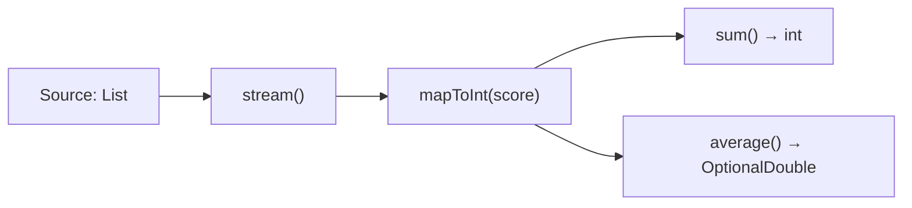
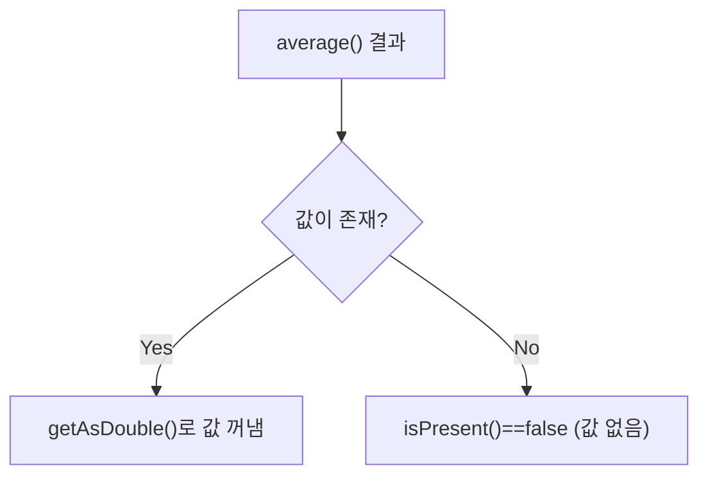

<br>

# ☕ Java Basic Learning - Day 12 (Stream / Optional)

Day12는 자바 **Stream(스트림) 파이프라인**을 이용해 컬렉션 데이터를 **선언형(메서드 체이닝)** 으로 처리하고,  
집계 결과에서 자주 등장하는 **OptionalDouble**의 의미와 사용법을 예제로 정리한 프로젝트입니다.

---

## 핵심 개념 한 장 요약

- **Stream 파이프라인**
  - 데이터 소스(컬렉션/배열 등) → 중간 연산 → 최종 연산(집계/수집) 형태로 처리합니다.
  - 스트림은 데이터를 “저장”하기보다 “흘려보내며 처리”하는 개념입니다.
- **중간 연산(Intermediate)**
  - 예: `map`, `filter`, `mapToInt` 등
  - 보통 **지연 실행(lazy)** 되어, 최종 연산이 호출될 때 실제로 동작합니다.
- **최종 연산(Terminal)**
  - 예: `sum`, `average`, `collect` 등
  - 최종 연산이 실행되면 파이프라인이 종료됩니다.
- **OptionalDouble**
  - 평균처럼 “값이 없을 수도 있는 결과”를 안전하게 표현하기 위한 래퍼 타입입니다.
  - 예: 빈 스트림에서 `average()`를 호출하면 결과가 비어 있을 수 있습니다.

---

## 실행 흐름 그림(mermaid)

### 1) Stream 파이프라인 전체 흐름



### 2) OptionalDouble 사용 흐름



---

## 코드 + 설명 (코드 아래에 바로 해설)

### `Student.java` (도메인 객체)

```java
package stream;

public class Student {
    private String name;
    private int score;

    public Student (String name, int score) {
        this.name = name;
        this.score = score;
    }
    public String getName() {
        return name;
    }
    public int getScore() {
        return score;
    }
}
```

- 스트림의 소스 데이터로 사용할 `Student` 클래스입니다.
- `score`를 스트림에서 꺼내 숫자 집계를 수행합니다.

---

### `StreamPipeLineExample.java` (sum / average 집계)

```java
package stream;

import java.util.ArrayList;
import java.util.Arrays;
import java.util.List;
import java.util.OptionalDouble;

public class StreamPipeLineExample {
    public static void main(String[] args) {
        List<Student> list = new ArrayList<>();
        list.add(new Student("홍길동", 10));
        list.add(new Student("신용권", 20));
        list.add(new Student("유미선", 30));

        List<Student> list2 = Arrays.asList(
                new Student("홍길동", 10),
                new Student("신용권", 20),
                new Student("유미선", 30)
        );

        int result = list2.stream()
                .mapToInt(student -> student.getScore())
                .sum();
        System.out.println(result);

        OptionalDouble result2 = list2.stream()
                .mapToInt(student -> student.getScore())
                .average();
        System.out.println(result2.getAsDouble());
        System.out.println(result2.isPresent());
    }
}
```

- `mapToInt(student -> student.getScore())`
  - `Student` 스트림을 **IntStream**으로 바꿔서 숫자 집계에 최적화된 연산(`sum`, `average`)을 사용합니다.
- `sum()`
  - 점수 합계를 `int`로 반환합니다.
- `average()`
  - 평균은 값이 없을 수 있어 `OptionalDouble`로 반환됩니다.
  - 값이 있다고 가정하면 `getAsDouble()`로 꺼낼 수 있고, 존재 여부는 `isPresent()`로 확인합니다.

---

## Stream vs 전통 반복문 비교(개념)

| 구분 | 전통 반복문 | Stream |
|---|---|---|
| 스타일 | 명령형(어떻게) | 선언형(무엇을) |
| 코드 형태 | 루프 + 누적 변수 | 파이프라인(체이닝) |
| 읽기/수정 | 로직이 길어질 수 있음 | 연산 단위로 읽기 쉬움 |
| 확장 | 조건/변환이 늘면 복잡 | `filter/map/...`로 조합 |

---

## OptionalDouble 빠른 표

| 메서드 | 의미 |
|---|---|
| `isPresent()` | 값이 존재하면 `true` |
| `getAsDouble()` | 값을 `double`로 꺼냄(없으면 예외 가능) |

> 실무에서는 보통 `isPresent()` 체크 또는 `orElse(...)` 계열을 함께 사용해 “값 없음”을 안전하게 처리합니다.

---

## 어떻게 실행하나요?

### IntelliJ IDEA 기준
- `day12-stream/src/stream`에서 `StreamPipeLineExample`의 `main()` 실행

<br>
<hr>
<br>

## 학습 포인트 체크리스트

- 스트림 파이프라인이 **Source → 중간 연산 → 최종 연산** 구조라는 걸 설명할 수 있는가?
- `mapToInt()`를 쓰면 왜 `sum()`/`average()`를 편하게 쓸 수 있는가?
- `average()`가 `OptionalDouble`을 반환하는 이유를 설명할 수 있는가?
