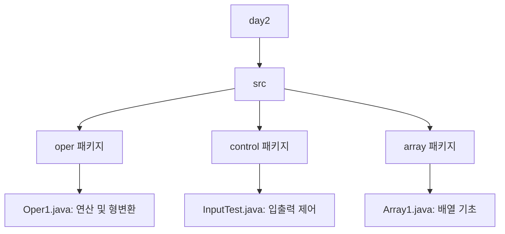

# ☕ Java Basic Learning - Day 2

Java 프로그래밍 기초 2일차 학습 내용 정리입니다. 연산자, 형변환, 입력(Scanner), 그리고 배열의 기초를 다룹니다.

## 📂 프로젝트 구조



---

## 📝 주요 학습 내용

### 1. 연산 및 형변환 (Casting)
`Oper1.java`에서는 기본적인 산술 연산과 데이터 타입 간의 변환을 학습합니다.

- **자동 형변환 (Promotion):** 작은 타입에서 큰 타입으로 변환될 때 자동으로 발생합니다. (예: `byte` -> `int` -> `double`)
- **강제 형변환 (Casting):** 큰 타입에서 작은 타입으로 변환할 때 데이터 손실을 감수하고 명시적으로 변환합니다. `(type)` 연산자를 사용합니다.
- **정수 연산의 특징:** 자바에서 `int` 간의 나눗셈 결과는 항상 `int`입니다. 실수 결과를 얻으려면 피연산자 중 하나를 `double`로 형변환해야 합니다.

### 2. 입출력 (Input/Output)
`InputTest.java`에서는 사용자로부터 입력을 받는 방법을 학습합니다.

- **System.out:** 표준 출력 장치 (모니터)
- **System.in:** 표준 입력 장치 (키보드)
- **Scanner 클래스:** `java.util.Scanner`를 사용하여 키보드 입력을 쉽게 처리할 수 있습니다.
  - `nextLine()`: 사용자로부터 한 줄의 문자열을 입력받습니다.
  - 모든 입력 데이터는 기본적으로 **문자열(String)** 타입으로 들어옵니다.

### 3. 배열 기초 (Array)
`Array1.java`에서는 데이터를 그룹으로 묶어 관리하는 배열을 다룹니다.

- **배열 선언 및 생성:** `int[] x = new int[10];`
- **참조형 변수:** 배열 변수 `x`를 출력하면 실제 값이 아닌 메모리 주소가 출력됩니다.
- **배열 길이:** `x.length`를 통해 배열의 크기를 확인할 수 있습니다.

---

## 🚀 실행 방법

각 Java 파일을 컴파일한 후 실행합니다.

```bash
# 예시: Oper1 실행
javac src/oper/Oper1.java
java -cp src oper.Oper1
```
