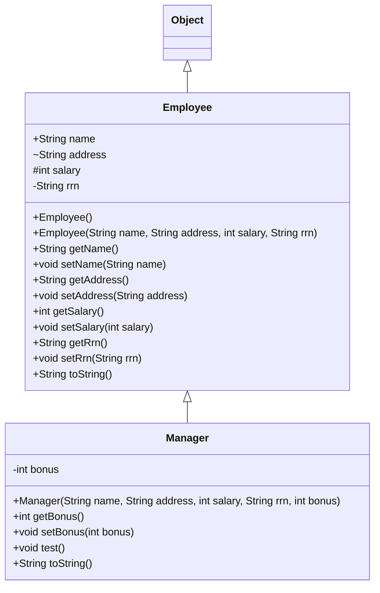

## day6-inherit (상속 Inheritance)

이 폴더는 **상속(`extends`)**, **접근 제어자(public/default/protected/private)**, **생성자에서 `super()` 호출**, **메서드 재정의(override)** 를 한 번에 확인하는 예제입니다.

---

### 폴더/파일 구조

```text
day6-inherit/
  src/
    inherit/
      Employee.java
      Manager.java
      CompanyUse.java
    test/
      Graphic2.java
```

---

### 핵심 개념 정리

#### 1) “모든 클래스는 Object를 상속한다”

- `Employee extends Object`는 **명시했든 안 했든 결과는 동일**합니다. (자바의 모든 클래스는 기본적으로 `Object`를 상속)
- 그래서 `toString()`, `equals()`, `hashCode()` 같은 기본 메서드를 “물려받고”, 필요하면 **재정의(override)** 해서 더 보기 좋은 출력으로 바꿉니다.

#### 2) 상속(extends) = “기능/필드 재사용 + 확장”

- `Manager extends Employee`는 **Employee의 필드/메서드를 그대로 사용**하면서, `bonus`, `test()` 같은 **추가 기능**을 더합니다.

#### 3) 생성자와 `super(...)`

- 자식 생성자에서 `super(...)`는 **부모(Employee) 쪽 초기화를 먼저 수행**하기 위한 호출입니다.
- 규칙: `super(...)`는 **생성자 첫 줄**에 와야 합니다.

#### 4) 접근 제어자(캡슐화)

- `public`: 어디서나 접근 가능
- (default): 같은 패키지에서만 접근 가능 (키워드 없음)
- `protected`: 같은 패키지 + 다른 패키지여도 “상속 관계”이면 접근 가능
- `private`: 해당 클래스 내부에서만 접근 가능 (외부에서는 getter/setter로 접근)

---

### 클래스 관계 그림 (UML 느낌)

아래 다이어그램은 실제 코드 구조(`Employee` ↔ `Manager`)를 그대로 표현합니다.



---

### 코드 흐름 설명 (CompanyUse)

`CompanyUse.main()`에서 하는 일은 크게 3개입니다.

1. `Employee` 객체 생성 → `System.out.println(e)`로 출력
2. 접근 제어자별로 “필드 직접 접근이 가능한지” 확인
3. `Manager` 객체 생성 → `toString()` 재정의 + 추가 메서드(`test()`) 사용

핵심 포인트는 **객체를 출력하면 항상 `toString()`이 호출**된다는 점입니다.

---

### 표로 요약

#### 1) 클래스별 역할

| 클래스 | 패키지 | 역할 | 핵심 포인트 |
|---|---|---|---|
| `Employee` | `inherit` | 직원 기본 정보(이름/주소/급여/주민번호) 모델 | `toString()`을 재정의해서 보기 좋은 출력 |
| `Manager` | `inherit` | 직원(Employee)을 확장한 관리자 모델 | `bonus` 추가 + `super(...)`로 부모 초기화 |
| `CompanyUse` | `inherit` | 실행(테스트) 클래스 | 필드 접근 제어자/오버라이딩 결과 확인 |
| `Graphic2` | `test` | Swing GUI 맛보기 | 상속보다는 “객체 생성 + setter 스타일 사용” 관점 |

#### 2) `Employee` 필드 접근 제어자 정리

| 필드 | 타입 | 접근 제어자 | 외부 접근(권장/가능) | 의미 |
|---|---|---|---|---|
| `name` | `String` | `public` | 직접 접근 가능(하지만 보통 getter/setter 권장) | 이름 |
| `address` | `String` | default | 같은 패키지에서만 직접 접근 | 주소 |
| `salary` | `int` | `protected` | 같은 패키지/상속 관계에서 접근 | 급여 |
| `rrn` | `String` | `private` | 직접 접근 불가 → `getRrn()` 사용 | 주민번호(민감정보) |

#### 3) `toString()` 오버라이딩 비교

| 클래스 | 구현 | 출력 형태(요약) |
|---|---|---|
| `Object` | 기본 제공 | `패키지.클래스@주소` |
| `Employee` | 재정의 | `name address salary rrn` |
| `Manager` | 재정의 | `Employee정보 + bonus` (`super.toString()` 활용) |

---

### “왜 private은 getter/setter로 접근할까?”

`rrn`처럼 민감한 데이터는

- “마구 변경/조회”를 막고,
- 필요한 곳에서만 규칙을 걸어서(예: 마스킹, 검증) 공개하려고

`private`로 숨긴 뒤 `getRrn()` / `setRrn()`로 통제하는 패턴을 사용합니다.

---

### 실행 방법 (간단)

이 프로젝트는 빌드 도구(pom/gradle) 없이도 실행할 수 있는 구조입니다.

- `inherit.CompanyUse` 실행: 상속/오버라이딩/접근제어자 확인
- `test.Graphic2` 실행: Swing 화면 확인

IDE(IntelliJ)에서 각 `main()` 클래스 우클릭 → Run 하면 가장 편합니다.

---

### 부록: 기존 이미지(수업 캡처)

아래는 기존 README에 있던 이미지 링크를 그대로 보관한 것입니다.


<br>
<hr>
<br>


