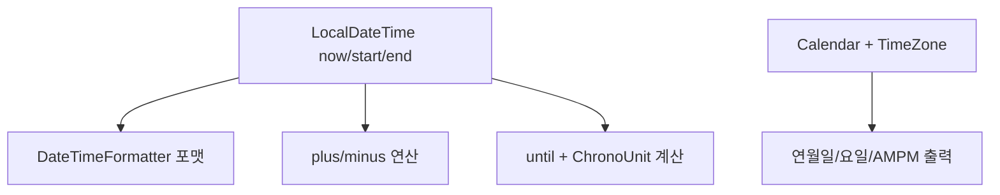
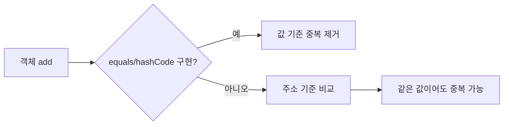

# Java Day8 Lib 실습 정리

새로 추가한 Java 파일들을 기준으로, 컬렉션 성능 비교/문자열 처리/날짜 시간 API/Set 중복 처리 실습을 한 번에 정리한 문서입니다.

## 프로젝트 구조

```text
day8-lib/
├── src/
│   ├── libs/
│   │   ├── CalendarPractice.java
│   │   ├── DateTimeComparePractice.java
│   │   ├── DateTimeOperationPractice.java
│   │   ├── SimpleGraphTest.java
│   │   ├── StringBuilderPractice.java
│   │   ├── TimeCompareTest.java
│   │   ├── TimeZonePractice.java
│   │   └── TokenPractice.java
│   └── test/
│       ├── SetTest1.java
│       ├── SetTest2.java
│       ├── SetTest3.java
│       ├── Student.java
│       └── Student2.java
└── README.md
```

## 1) 컬렉션 성능 비교

### `TimeCompareTest.java`

- 배열, `ArrayList`, `LinkedList`의 삽입/조회 시간을 `System.nanoTime()`으로 비교합니다.
- 특히 `LinkedList.get(i)`를 반복하면 매우 느려질 수 있다는 점을 확인합니다.

```java
final int SIZE = 100000;
LinkedList<Integer> linkedList = new LinkedList<>();

for (int i = 0; i < SIZE; i++) {
    linkedList.add(i);
}

long start = System.nanoTime();
int sum = 0;
for (int i = 0; i < SIZE; i++) {
    sum += linkedList.get(i);
}
long end = System.nanoTime();
System.out.println("LinkedList 조회 시간: " + (end - start));
```

### `SimpleGraphTest.java`

- 중간 인덱스 접근(`get(size/2)`)을 측정해서 막대 그래프처럼 출력합니다.

```java
public static void printGraph(String name, long time) {
    int length = (int) (time / 1000);
    System.out.printf("%-12s | ", name);
    for (int i = 0; i < length; i++) {
        System.out.print("■");
    }
    System.out.println(" " + time + " ns");
}
```

## 그림: List 접근 성능 개념도

```mermaid
flowchart LR
    A[ArrayList] -->|index 접근 O(1)| B[빠른 조회]
    C[LinkedList] -->|index 접근 O(n)| D[느린 조회]
    E[TimeCompareTest] --> F[nanoTime 측정]
    F --> B
    F --> D
```

## 2) 문자열 처리 실습

### `StringBuilderPractice.java`

- 문자열을 append/insert/replace로 가공하고 최종 문자열로 변환합니다.

```java
String result = new StringBuilder()
        .append("World")
        .insert(0, "Hello ")
        .replace(6, 11, "Java")
        .toString();
System.out.println(result); // Hello Java
```

### `TokenPractice.java`

- `split()`과 `StringTokenizer`를 각각 사용해 토큰 분리 방식을 비교합니다.

```java
String data1 = "홍길동&이수홍,박연수";
String[] arr = data1.split("&|,");

String data2 = "홍길동/이수홍/박연수";
StringTokenizer st = new StringTokenizer(data2, "/");
```

## 3) 날짜/시간 API 실습

### `DateTimeOperationPractice.java`

- `LocalDateTime`의 가감 연산(`plusYears`, `minusMonths`, `plusDays`)을 연습합니다.

### `DateTimeComparePractice.java`

- 시작/종료 시점을 비교하고, `ChronoUnit`으로 차이를 월/일/시간 단위로 계산합니다.

```java
System.out.println("남은 월: " + start.until(end, ChronoUnit.MONTHS));
System.out.println("남은 일: " + start.until(end, ChronoUnit.DAYS));
System.out.println("남은 시간: " + start.until(end, ChronoUnit.HOURS));
```

### `CalendarPractice.java` / `TimeZonePractice.java`

- `Calendar` 필드 추출(연/월/일/요일/오전오후), `TimeZone` 지정(`Asia/Seoul`)을 실습합니다.

## 그림: 날짜/시간 처리 흐름



## 4) Set 중복 처리 실습

### `SetTest1.java`

- 문자열(`String`)은 값 기반 비교가 이미 구현되어 있어 중복이 제거됩니다.

### `SetTest2.java` + `Student.java`

- Lombok `@Data`를 사용한 `Student`는 `equals/hashCode`가 자동 생성되어 Set 중복 체크가 정상 동작합니다.

```java
@Data
@NoArgsConstructor
@AllArgsConstructor
@RequiredArgsConstructor
public class Student {
    @NonNull String id;
    String name;
}
```

### `SetTest3.java` + `Student2.java`

- `Student2`는 기본 상태에서 `equals/hashCode`가 없으므로 같은 값도 다른 객체로 처리됩니다.
- 파일의 주석 예시처럼 `equals/hashCode` 오버라이드 후에는 중복 체크가 올바르게 동작합니다.

## 그림: Set 중복 판단 원리



## 실행 방법

IntelliJ에서 각 파일의 `main()`을 실행하면 됩니다.

- 컬렉션 비교: `libs.TimeCompareTest`, `libs.SimpleGraphTest`
- 문자열 처리: `libs.StringBuilderPractice`, `libs.TokenPractice`
- 날짜/시간: `libs.DateTimeOperationPractice`, `libs.DateTimeComparePractice`, `libs.CalendarPractice`, `libs.TimeZonePractice`
- Set 동작: `test.SetTest1`, `test.SetTest2`, `test.SetTest3`
