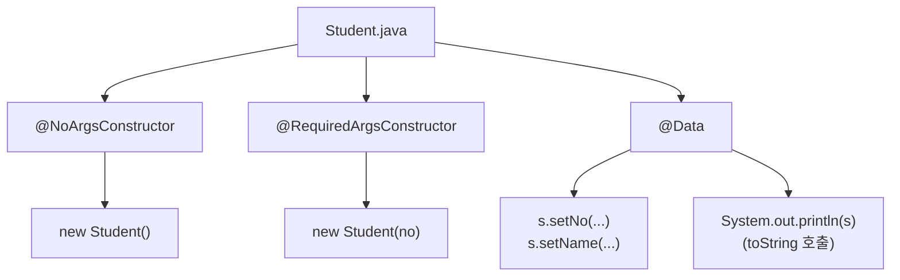
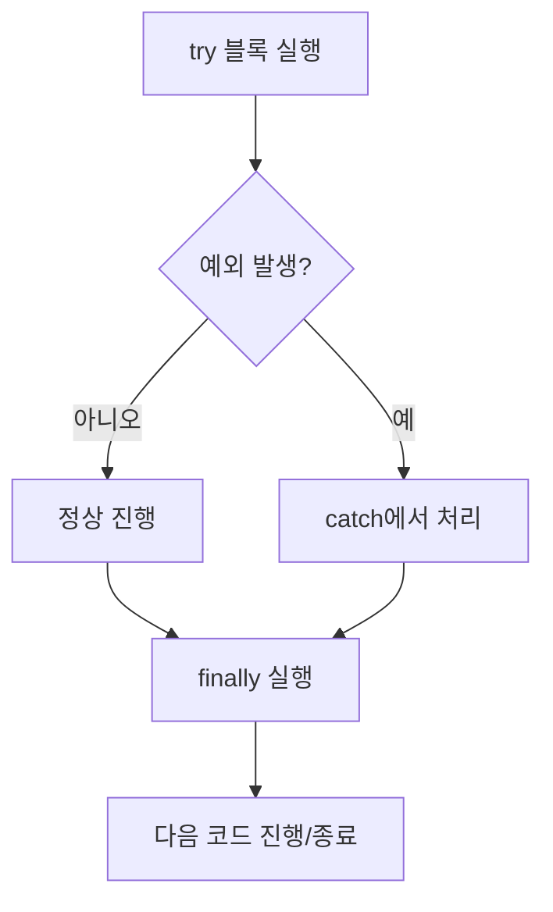

# ☕ Java Basic Learning - Day 8 (라이브러리 Lombok, 예외처리)

Day 8에서는 **외부 라이브러리(Lombok)** 를 사용해 `getter/setter/toString/생성자`를 자동 생성하고,  
`try-catch-finally`와 **try-with-resources**로 예외처리 + 파일 쓰기(`FileWriter`)를 연습합니다.

---

### 🔗 파일 구조 (day8-lib)

```
day8-lib/
├── src/
│   ├── libs/
│   │   ├── Student.java        # Lombok으로 DTO(데이터 클래스) 만들기
│   │   └── StudentUse.java     # Student 생성/출력 사용(main)
│   └── test/
│       ├── Test1.java          # try-catch 기본 흐름(main)
│       ├── Test2.java          # FileWriter + 다중 catch + finally(main)
│       └── Test3.java          # try-with-resources(main)
├── test.txt                    # 파일쓰기 결과(실행 후 생성/갱신)
└── README.md
```

---

### 1) `Student.java` (Lombok: @Data + 생성자 자동 생성)

```java
package libs;

import lombok.*;

@NoArgsConstructor
@RequiredArgsConstructor
@Data
public class Student {

    @NonNull
    private String no;
    private String name;
}
```

- **핵심**: Lombok을 쓰면 반복 코드(생성자/게터/세터/toString/equals/hashCode)를 자동 생성해서 **코드를 짧게 유지**할 수 있음
- **포인트**: `@NonNull`이 붙은 필드(`no`)는 `@RequiredArgsConstructor`의 생성자 파라미터에 포함됨  
  → 즉, `new Student("200")` 같은 생성이 가능

---

### 2) `StudentUse.java` (기본 생성자 vs 필수 생성자 사용)

```java
package libs;

public class StudentUse {
    public static void main(String[] args) {
        Student s = new Student();
        s.setNo("100");
        System.out.println(s);

        Student s1 = new Student("200");
        System.out.println(s1);
    }
}
```

- **핵심**: `new Student()`는 `@NoArgsConstructor`로 생성된 기본 생성자
- **핵심**: `new Student("200")`는 `@RequiredArgsConstructor`로 생성된 “필수값(no)만 받는 생성자”
- **참고**: `System.out.println(s)`는 Lombok의 `@Data`가 만든 `toString()`이 호출되어 필드가 보기 좋게 출력됨

---

### 3) `Test1.java` (try-catch로 실행 흐름 끊김 방지)

```java
package test;

public class Test1 {
    public static void main(String[] args) {
        System.out.println("1. 나는 프린트될 예정");
        try {
            System.out.println("2. 실행에러 있는 코드 " + 10 / 0);
        } catch (Exception e) {
            // 예외가 발생해도 프로그램이 종료되지 않게 잡아줌
        }
        System.out.println("3. 나는 프린트될까요???");
    }
}
```

- **핵심**: 예외가 나도 `catch`에서 잡으면 프로그램이 바로 종료되지 않고 다음 코드로 진행 가능
- **포인트**: `Exception`으로 넓게 잡을 수도 있지만, 실무/학습에서는 가능한 **구체적 예외부터 잡는 습관**이 좋음

---

### 4) `Test2.java` (FileWriter + 다중 catch + finally)

```java
package test;

import java.io.FileWriter;
import java.io.IOException;

public class Test2 {
    public static void main(String[] args) {
        try {
            FileWriter file = new FileWriter("test.txt");
            file.write("오늘은 목요일 \n");
            file.write("내일은 깃특강 \n");
            file.write("다음주에 만나요. \n");
            file.close();

            System.out.println(10 / 0);
        } catch (IOException e) {
            System.out.println("파일 쓰기 에러 : " + e.getMessage());
        } catch (ArithmeticException e) {
            System.out.println("수학 에러 : " + e.getMessage());
        } catch (Exception e) {
            System.out.println("위 catch에서 지정하지 않은 예외상황 : " + e.getMessage());
        } finally {
            System.out.println("예외 발생 여부와 상관없이 무조건 실행하는 코드는 여기에 넣어주세요.");
        }
    }
}
```

- **핵심**: `IOException`(파일 관련) / `ArithmeticException`(0으로 나눔) 등 예외 종류별로 다른 메시지/대응이 가능
- **핵심**: `finally`는 예외 발생 여부와 관계없이 실행 → **마무리 작업(정리/로그 등)** 에 자주 사용
- **주의**: `close()`를 까먹으면 스트림이 RAM에 남을 수 있음(자원 누수) → 아래 `Test3`처럼 자동 close를 추천

---

### 5) `Test3.java` (try-with-resources: 자동 close)

```java
package test;

import java.io.FileWriter;
import java.io.IOException;

public class Test3 {
    public static void main(String[] args) {
        try (FileWriter file = new FileWriter("test.txt")) {
            file.write("오늘은 목요일 \n");
            file.write("내일은 깃특강 \n");
            file.write("다음주에 만나요. \n");
            System.out.println(10 / 0);
        } catch (IOException e) {
            System.out.println("파일 쓰기 에러 : " + e.getMessage());
        } catch (ArithmeticException e) {
            System.out.println("수학 에러 : " + e.getMessage());
        } catch (Exception e) {
            System.out.println("위 catch에서 지정하지 않은 예외상황 : " + e.getMessage());
        } finally {
            System.out.println("예외 발생 여부와 상관없이 무조건 실행하는 코드는 여기에 넣어주세요.");
        }
    }
}
```

- **핵심**: `try (...) {}` 괄호 안에 자원을 선언하면, 블록이 끝날 때 **자동으로 close()** 됨
- **추천**: 파일/DB/네트워크처럼 “열고 닫는” 자원은 try-with-resources 형태가 안전함

---

### 표로 요약

#### 1) Lombok 어노테이션 정리

| 어노테이션 | 의미 | Student에서의 효과 |
|---|---|---|
| `@Data` | `@Getter/@Setter/@ToString/@EqualsAndHashCode/@RequiredArgsConstructor` 포함(기본 구성) | getter/setter/toString 자동 생성 |
| `@NoArgsConstructor` | 기본 생성자 생성 | `new Student()` 가능 |
| `@RequiredArgsConstructor` | `final` 또는 `@NonNull` 필드만 받는 생성자 생성 | `new Student("200")` 가능 |
| `@NonNull` | null 체크 대상(필수 값) | `no`가 “필수 생성자” 파라미터에 포함 |

#### 2) 예외처리 흐름 정리

| 구분 | 언제 실행? | 목적 |
|---|---|---|
| `try` | 정상 코드 실행 구간 | 예외가 날 수 있는 코드 묶기 |
| `catch` | try에서 예외 발생 시 | 예외를 잡고 대체 흐름 처리 |
| `finally` | 예외 발생 여부와 무관 | 정리/마무리/로그 같은 공통 처리 |

---

### 그림으로 이해하기

#### 1) Lombok 기반 객체 생성 흐름



#### 2) try-catch-finally 실행 흐름



---

### 실행 방법 (간단)

IntelliJ에서 각 `main()` 클래스 우클릭 → Run.

- `libs.StudentUse` 실행: Lombok 생성자/세터/toString 확인
- `test.Test1` 실행: try-catch 흐름 확인
- `test.Test2` 실행: `FileWriter`로 `test.txt` 생성 + 예외/ finally 흐름 확인
- `test.Test3` 실행: try-with-resources로 자동 close 확인
<br>
<br>
- 인텔리제이 auto import 설정

<hr>
- jdk17 라이브러리 api문서 : https://docs.oracle.com/en/java/javase/17/docs/api/index.html
<br>
<hr>
<br>
- 예외처리


<br>
- 인텔리제이에서 try-catch자동생성


<br>
<hr>
- 하나의 프로젝트안에서 모듈 별 구현 가능하다. <br>
- 자바는 프로젝트를 다 완성하면 jar로 압축해서 서버로 파일을 옮긴다.


- 회사에서 사용할 라이브러리 만들기
--> 모듈만들기(jar파일로 묶어야함.) --> 사용하기

```
모듈만들기(jar파일로 묶어야함.) --> 사용하기package test;

// day8-libs 프로젝트 아래 test패키지
package test;

public class Cal {
    public void add(int a, int b) {
        int c = a + b;
        System.out.println(c);
    }

    public void sub(int a, int b) {
        int c = a - b;
        System.out.println(c);
    }
}

// -----------------------------------

package test;

public class Cal2 {
    public void mul(int a, int b) {
        int c = a * b;
        System.out.println(c);
    }

    public void div(int a, int b) {
        int c = a / b;
        System.out.println(c);
    }
}

//day8-lib 프로젝트 아래 test패키지


public class LibTest {
    public static void main(String[] args) {
        Cal cal = new Cal();
        cal.add(100, 200);
        Cal2 cal2 = new Cal2();
        cal2.mul(100, 200);
    }
}

```


--> 다른 프로젝트에서 사용


<br>
- 롬복라이브러리
--> 클래스의 기본 구조에 해당하는 메서드를 자동으로 생성해줌
--> 다운로드 : https://mvnrepository.com/artifact/org.projectlombok/lombok/1.18.40
--> 현재 우리가 사용하는 버전에서는 @NoArgsConstructor, @AllArgsConstructor와 함께 @Data를 사용하는 경우 기본 생성자만 만들어집니다.
--> 함께 사용하는 경우 별도로 @RequiredArgsConstructor를 명시해주세요.!!


```

package test;

import lombok.*;

@ToString
@Data
@AllArgsConstructor
@RequiredArgsConstructor
public class Bag {

    @NonNull
    private String name;
    private String description;
    private double price;
}

--------------------------

package test;


public class LombokTest {
    public static void main(String[] args) {
        Bag bag = new Bag("홍길동",
                "목요일이야",
                1000);

        System.out.println(bag.getName());
        bag.setName("김길동");
        System.out.println(bag);


    }
}

```
- record도 일부 자동생성해주는 기능이 있음. 메서드이름이 약간 다름


```
package test;

public record MemberRecord(String id, String name, int age) {
}

-----------------------
package test;

public class MemberRecordUse {
    public static void main(String[] args) {
        MemberRecord m1 = new MemberRecord("winter", "눈송이", 25);
        MemberRecord m2 = new MemberRecord("winter", "눈송이", 25);

        System.out.println(m1.id());
        System.out.println(m1.name());
        System.out.println(m1.age());
        System.out.println(m1);
        System.out.println("equals: " + m1.equals(m2));
        System.out.println("hashCode 비교: " + (m1.hashCode() == m2.hashCode()));
    }
}

```


- 대표적인 라이브러리

<br>
- System.nanoTime()을 이용한 성능평가(배열과 List비교)

```
System.nanoTime()을 이용한 성능평가(배열과 List비교)
package test;

import java.util.ArrayList;
import java.util.LinkedList;

public class TimeCompareTest {

    public static void main(String[] args) {

        final int SIZE = 100000;

        // =========================
        // 1. 배열
        // =========================
        int[] arr = new int[SIZE];

        long start = System.nanoTime();

        // 값 넣기
        for (int i = 0; i < SIZE; i++) {
            arr[i] = i;
        }

        long end = System.nanoTime();
        System.out.println("배열 입력 시간: " + (end - start));

        start = System.nanoTime();

        // 조회
        int sum = 0;
        for (int i = 0; i < SIZE; i++) {
            sum += arr[i];
        }

        end = System.nanoTime();
        System.out.println("배열 조회 시간: " + (end - start));


        // =========================
        // 2. ArrayList
        // =========================
        ArrayList<Integer> arrayList = new ArrayList<>();

        start = System.nanoTime();

        // 추가
        for (int i = 0; i < SIZE; i++) {
            arrayList.add(i);
        }

        end = System.nanoTime();
        System.out.println("ArrayList 추가 시간: " + (end - start));

        start = System.nanoTime();

        // 조회
        sum = 0;
        for (int i = 0; i < SIZE; i++) {
            sum += arrayList.get(i);
        }

        end = System.nanoTime();
        System.out.println("ArrayList 조회 시간: " + (end - start));


        // =========================
        // 3. LinkedList
        // =========================
        LinkedList<Integer> linkedList = new LinkedList<>();

        start = System.nanoTime();

        // 추가
        for (int i = 0; i < SIZE; i++) {
            linkedList.add(i);
        }

        end = System.nanoTime();
        System.out.println("LinkedList 추가 시간: " + (end - start));

        start = System.nanoTime();

        // 조회 (⚠️ 매우 느림)
        sum = 0;
        for (int i = 0; i < SIZE; i++) {
            sum += linkedList.get(i);
        }

        end = System.nanoTime();
        System.out.println("LinkedList 조회 시간: " + (end - start));
    }
}

```
<br>
- 그래프로 비교

```
import java.util.*;

public class SimpleGraphTest {

    public static void main(String[] args) {

        int size = 100000;

        ArrayList<Integer> arrayList = new ArrayList<>();
        LinkedList<Integer> linkedList = new LinkedList<>();

        // 데이터 채우기
        for (int i = 0; i < size; i++) {
            arrayList.add(i);
            linkedList.add(i);
        }

        // =====================
        // 측정
        // =====================
        long start = System.nanoTime();
        arrayList.get(size / 2);
        long arrayTime = System.nanoTime() - start;

        start = System.nanoTime();
        linkedList.get(size / 2);
        long linkedTime = System.nanoTime() - start;

        // =====================
        // 그래프 출력
        // =====================
        printGraph("ArrayList", arrayTime);
        printGraph("LinkedList", linkedTime);
    }

    public static void printGraph(String name, long time) {
        int length = (int)(time / 1000); // scale

        System.out.printf("%-12s | ", name);
        for (int i = 0; i < length; i++) {
            System.out.print("■");
        }
        System.out.println(" " + time + " ns");
    }
}


ArrayList   | ■■■■■ 5000 ns
LinkedList  | ■■■■■■■■■■■■■■■■■■■■■■■■■■■■■■■■■■■■■■■■■■■ 500000 ns

```
<br>


<br>
- 래퍼클래스(포장클래스) : 형변환 + 포장클래스(클래스 <--- 박싱/언박싱 ---> 기본형)


- Wrapper class주의점
- Integer는 immutable (불변 객체)

```
Wrapper class주의점
Integer는 immutable (불변 객체)
package test;

public class ValueComparePractice {
    public static void main(String[] args) {
        //-128~127범위가 아니므로 각각 주소를 만든다.
        Integer a = 300;
        Integer b = 300;
        System.out.println(a.intValue());
        System.out.println("300 비교");
        System.out.println("주소 비교 == : " + (a == b)); //false
        System.out.println("값 비교 equals : " + a.equals(b)); //true
        System.out.println("a identityHashCode: " + System.identityHashCode(a));
        System.out.println("b identityHashCode: " + System.identityHashCode(b));
        System.out.println("\n값 변경 후");
        a =  100;
        System.out.println("주소 비교 == : " + (a == b)); //false
        System.out.println("a identityHashCode: " + System.identityHashCode(a));
        System.out.println("b identityHashCode: " + System.identityHashCode(b));

        System.out.println("======================");

        //-128-127까지는 클래스로 저장시 미리 넣어둠.
        Integer c = 10;
        Integer d = 10;
        System.out.println("\n10 비교");
        System.out.println("== : " + (c == d)); //true
        System.out.println("equals : " + c.equals(d)); //true
        System.out.println("c identityHashCode: " + System.identityHashCode(c));
        System.out.println("d identityHashCode: " + System.identityHashCode(d));

        System.out.println("\n값 변경 후");
        c = 100;
        System.out.println("== : " + (c == d)); //false
        System.out.println("equals : " + c.equals(d)); //false
        System.out.println("초기 상태");
        System.out.println("c identityHashCode: " + System.identityHashCode(c));
        System.out.println("d identityHashCode: " + System.identityHashCode(d));
        }
}


```
<br>


<br>
- StringBuilder

```
StringBuilder
public class StringBuilderPractice {
    public static void main(String[] args) {
        String result = new StringBuilder()
                .append("World")
                .insert(0, "Hello ")
                .replace(6, 11, "Java")
                .toString();

        System.out.println(result);
    }
}

```
<br>
- StringTokenizer
```
import java.util.StringTokenizer;

public class TokenPractice {
    public static void main(String[] args) {
        String data1 = "홍길동&이수홍,박연수";
        String[] arr = data1.split("&|,");

        System.out.println("[split 결과]");
        for (String name : arr) {
            System.out.println(name);
        }

        System.out.println();

        String data2 = "홍길동/이수홍/박연수";
        StringTokenizer st = new StringTokenizer(data2, "/");

        System.out.println("[StringTokenizer 결과]");
        while (st.hasMoreTokens()) {
            System.out.println(st.nextToken());
        }
    }
}

```

<br>

- LocalDateTime

```
LocalDateTime
import java.time.LocalDateTime;
import java.time.temporal.ChronoUnit;
import java.time.format.DateTimeFormatter;

public class DateTimeComparePractice {
    public static void main(String[] args) {
        DateTimeFormatter dtf = DateTimeFormatter.ofPattern("yyyy.MM.dd a HH:mm:ss");

        LocalDateTime start = LocalDateTime.of(2026, 4, 1, 9, 0, 0);
        LocalDateTime end = LocalDateTime.of(2026, 12, 31, 18, 0, 0);

        System.out.println("시작: " + start.format(dtf));
        System.out.println("종료: " + end.format(dtf));

        if (start.isBefore(end)) {
            System.out.println("종료일 전입니다.");
        } else if (start.isEqual(end)) {
            System.out.println("같은 시각입니다.");
        } else {
            System.out.println("종료일이 지났습니다.");
        }

        System.out.println("남은 월: " + start.until(end, ChronoUnit.MONTHS));
        System.out.println("남은 일: " + start.until(end, ChronoUnit.DAYS));
        System.out.println("남은 시간: " + start.until(end, ChronoUnit.HOURS));
    }
}
```
```

import java.time.LocalDateTime;
import java.time.format.DateTimeFormatter;

public class DateTimeOperationPractice {
    public static void main(String[] args) {
        LocalDateTime now = LocalDateTime.now();
        DateTimeFormatter dtf = DateTimeFormatter.ofPattern("yyyy.MM.dd a HH:mm:ss");

        System.out.println("현재 시간: " + now.format(dtf));
        System.out.println("1년 후: " + now.plusYears(1).format(dtf));
        System.out.println("2개월 전: " + now.minusMonths(2).format(dtf));
        System.out.println("7일 후: " + now.plusDays(7).format(dtf));
    }
}

```
<br>
- TimeZone

```
import java.util.Calendar;
import java.util.TimeZone;

public class TimeZonePractice {
    public static void main(String[] args) {
        // 대한민국 시간대
        TimeZone timeZone = TimeZone.getTimeZone("Asia/Seoul");
        Calendar now = Calendar.getInstance(timeZone);

        String amPm = now.get(Calendar.AM_PM) == Calendar.AM ? "오전" : "오후";

        System.out.println("대한민국 현재 시간");
        System.out.println(amPm + " " +
                now.get(Calendar.HOUR) + "시 " +
                now.get(Calendar.MINUTE) + "분 " +
                now.get(Calendar.SECOND) + "초");
    }
}
```
<br>

- Calender

```
import java.util.Calendar;

public class CalendarPractice {
    public static void main(String[] args) {
        Calendar now = Calendar.getInstance();

        int year = now.get(Calendar.YEAR);
        int month = now.get(Calendar.MONTH) + 1;
        int day = now.get(Calendar.DAY_OF_MONTH);
        int week = now.get(Calendar.DAY_OF_WEEK);
        int amPm = now.get(Calendar.AM_PM);
        int hour = now.get(Calendar.HOUR);
        int minute = now.get(Calendar.MINUTE);

        String weekName;
        switch (week) {
            case Calendar.MONDAY -> weekName = "월";
            case Calendar.TUESDAY -> weekName = "화";
            case Calendar.WEDNESDAY -> weekName = "수";
            case Calendar.THURSDAY -> weekName = "목";
            case Calendar.FRIDAY -> weekName = "금";
            case Calendar.SATURDAY -> weekName = "토";
            default -> weekName = "일";
        }

        String amPmText = (amPm == Calendar.AM) ? "오전" : "오후";

        System.out.println(year + "년 " + month + "월 " + day + "일");
        System.out.println("요일: " + weekName);
        System.out.println(amPmText + " " + hour + "시 " + minute + "분");
    }
}

```
<br>

- Date

```
import java.text.SimpleDateFormat;
import java.util.Date;

public class DatePractice {
    public static void main(String[] args) {
        Date now = new Date();

        // 기본 출력
        System.out.println(now.toString());

        // 포맷 출력
        SimpleDateFormat sdf = new SimpleDateFormat("yyyy.MM.dd HH:mm:ss");
        System.out.println(sdf.format(now));

        // ⭐ Date 기본 메서드들
        System.out.println("\n[Date 기본 메서드]");

        System.out.println("연도: " + (now.getYear() + 1900)); // 1900 기준이라 보정 필요
        System.out.println("월: " + (now.getMonth() + 1));    // 0부터 시작이라 +1
        System.out.println("일: " + now.getDate());

        System.out.println("시간: " + now.getHours());
        System.out.println("분: " + now.getMinutes());
        System.out.println("초: " + now.getSeconds());
    }
}

```
<br>

- Random

```
import java.util.Arrays;
import java.util.Random;

public class RandomLottoPractice {
    public static void main(String[] args) {
        int[] selectNumber = new int[6];
        int[] winningNumber = new int[6];

        Random random = new Random(3);
        for (int i = 0; i < 6; i++) {
            selectNumber[i] = random.nextInt(45) + 1;
        }

        random = new Random(5);
        for (int i = 0; i < 6; i++) {
            winningNumber[i] = random.nextInt(45) + 1;
        }

        Arrays.sort(selectNumber);
        Arrays.sort(winningNumber);

        System.out.println("선택번호: " + Arrays.toString(selectNumber));
        System.out.println("당첨번호: " + Arrays.toString(winningNumber));
        System.out.println("일치 여부: " + Arrays.equals(selectNumber, winningNumber));
    }
}

```
<br>

- Math

```
Math
public class MathPractice {
    public static void main(String[] args) {
        System.out.println("ceil(5.3) = " + Math.ceil(5.3));
        System.out.println("floor(5.3) = " + Math.floor(5.3));
        System.out.println("max(3, 7) = " + Math.max(3, 7));
        System.out.println("min(3, 7) = " + Math.min(3, 7));

        double value = 12.3456;
        double rounded = Math.round(value * 100) / 100.0;
        System.out.println("소수 둘째 자리 반올림: " + rounded);
    }
}

```
<br>


