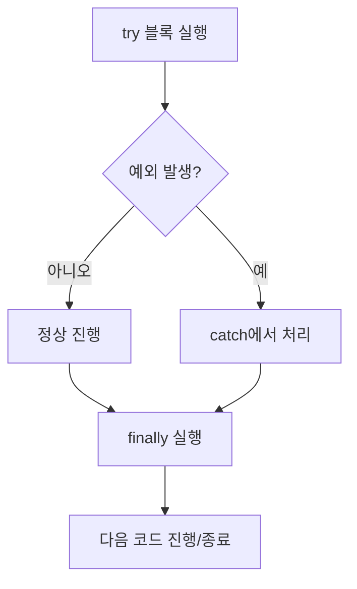

# ☕ Java Basic Learning - Day 8 (라이브러리 Lombok, 예외처리, 파일 입출력)

Day 8에서는 **외부 라이브러리(Lombok)** 를 사용해 `getter/setter/toString/생성자`를 자동 생성하고,  
`try-catch-finally`와 **try-with-resources**로 예외처리 + 파일 쓰기(`FileWriter`)를 연습합니다.

---

### 🔗 파일 구조 (day8-lib)

```
day8-lib/
├── src/
│   ├── libs/
│   │   ├── Student.java        # Lombok으로 DTO(데이터 클래스) 만들기
│   │   └── StudentUse.java     # Student 생성/출력 사용(main)
│   └── test/
│       ├── Test1.java          # try-catch 기본 흐름(main)
│       ├── Test2.java          # FileWriter + 다중 catch + finally(main)
│       └── Test3.java          # try-with-resources(main)
├── test.txt                    # 파일쓰기 결과(실행 후 생성/갱신)
└── README.md
```

---

### 1) `Student.java` (Lombok: @Data + 생성자 자동 생성)

```java
package libs;

import lombok.*;

@NoArgsConstructor
@RequiredArgsConstructor
@Data
public class Student {

    @NonNull
    private String no;
    private String name;
}
```

- **핵심**: Lombok을 쓰면 반복 코드(생성자/게터/세터/toString/equals/hashCode)를 자동 생성해서 **코드를 짧게 유지**할 수 있음
- **포인트**: `@NonNull`이 붙은 필드(`no`)는 `@RequiredArgsConstructor`의 생성자 파라미터에 포함됨  
  → 즉, `new Student("200")` 같은 생성이 가능

---

### 2) `StudentUse.java` (기본 생성자 vs 필수 생성자 사용)

```java
package libs;

public class StudentUse {
    public static void main(String[] args) {
        Student s = new Student();
        s.setNo("100");
        System.out.println(s);

        Student s1 = new Student("200");
        System.out.println(s1);
    }
}
```

- **핵심**: `new Student()`는 `@NoArgsConstructor`로 생성된 기본 생성자
- **핵심**: `new Student("200")`는 `@RequiredArgsConstructor`로 생성된 “필수값(no)만 받는 생성자”
- **참고**: `System.out.println(s)`는 Lombok의 `@Data`가 만든 `toString()`이 호출되어 필드가 보기 좋게 출력됨

---

### 3) `Test1.java` (try-catch로 실행 흐름 끊김 방지)

```java
package test;

public class Test1 {
    public static void main(String[] args) {
        System.out.println("1. 나는 프린트될 예정");
        try {
            System.out.println("2. 실행에러 있는 코드 " + 10 / 0);
        } catch (Exception e) {
            // 예외가 발생해도 프로그램이 종료되지 않게 잡아줌
        }
        System.out.println("3. 나는 프린트될까요???");
    }
}
```

- **핵심**: 예외가 나도 `catch`에서 잡으면 프로그램이 바로 종료되지 않고 다음 코드로 진행 가능
- **포인트**: `Exception`으로 넓게 잡을 수도 있지만, 실무/학습에서는 가능한 **구체 예외부터 잡는 습관**이 좋음

---

### 4) `Test2.java` (FileWriter + 다중 catch + finally)

```java
package test;

import java.io.FileWriter;
import java.io.IOException;

public class Test2 {
    public static void main(String[] args) {
        try {
            FileWriter file = new FileWriter("test.txt");
            file.write("오늘은 목요일 \n");
            file.write("내일은 깃특강 \n");
            file.write("다음주에 만나요. \n");
            file.close();

            System.out.println(10 / 0);
        } catch (IOException e) {
            System.out.println("파일 쓰기 에러 : " + e.getMessage());
        } catch (ArithmeticException e) {
            System.out.println("수학 에러 : " + e.getMessage());
        } catch (Exception e) {
            System.out.println("위 catch에서 지정하지 않은 예외상황 : " + e.getMessage());
        } finally {
            System.out.println("예외 발생 여부와 상관없이 무조건 실행하는 코드는 여기에 넣어주세요.");
        }
    }
}
```

- **핵심**: `IOException`(파일 관련) / `ArithmeticException`(0으로 나눔) 등 예외 종류별로 다른 메시지/대응이 가능
- **핵심**: `finally`는 예외 발생 여부와 관계없이 실행 → **마무리 작업(정리/로그 등)** 에 자주 사용
- **주의**: `close()`를 까먹으면 스트림이 RAM에 남을 수 있음(자원 누수) → 아래 `Test3`처럼 자동 close를 추천

---

### 5) `Test3.java` (try-with-resources: 자동 close)

```java
package test;

import java.io.FileWriter;
import java.io.IOException;

public class Test3 {
    public static void main(String[] args) {
        try (FileWriter file = new FileWriter("test.txt")) {
            file.write("오늘은 목요일 \n");
            file.write("내일은 깃특강 \n");
            file.write("다음주에 만나요. \n");
            System.out.println(10 / 0);
        } catch (IOException e) {
            System.out.println("파일 쓰기 에러 : " + e.getMessage());
        } catch (ArithmeticException e) {
            System.out.println("수학 에러 : " + e.getMessage());
        } catch (Exception e) {
            System.out.println("위 catch에서 지정하지 않은 예외상황 : " + e.getMessage());
        } finally {
            System.out.println("예외 발생 여부와 상관없이 무조건 실행하는 코드는 여기에 넣어주세요.");
        }
    }
}
```

- **핵심**: `try (...) {}` 괄호 안에 자원을 선언하면, 블록이 끝날 때 **자동으로 close()** 됨
- **추천**: 파일/DB/네트워크처럼 “열고 닫는” 자원은 try-with-resources 형태가 안전함

---

### 표로 요약

#### 1) Lombok 어노테이션 정리

| 어노테이션 | 의미 | Student에서의 효과 |
|---|---|---|
| `@Data` | `@Getter/@Setter/@ToString/@EqualsAndHashCode/@RequiredArgsConstructor` 포함(기본 구성) | getter/setter/toString 자동 생성 |
| `@NoArgsConstructor` | 기본 생성자 생성 | `new Student()` 가능 |
| `@RequiredArgsConstructor` | `final` 또는 `@NonNull` 필드만 받는 생성자 생성 | `new Student("200")` 가능 |
| `@NonNull` | null 체크 대상(필수 값) | `no`가 “필수 생성자” 파라미터에 포함 |

#### 2) 예외처리 흐름 정리

| 구분 | 언제 실행? | 목적 |
|---|---|---|
| `try` | 정상 코드 실행 구간 | 예외가 날 수 있는 코드 묶기 |
| `catch` | try에서 예외 발생 시 | 예외를 잡고 대체 흐름 처리 |
| `finally` | 예외 발생 여부와 무관 | 정리/마무리/로그 같은 공통 처리 |

---

### 그림으로 이해하기

#### 1) Lombok 기반 객체 생성 흐름

```mermaid
flowchart TD
  A[Student.java] --> B[@NoArgsConstructor]
  A --> C[@RequiredArgsConstructor]
  A --> D[@Data]

  B --> E[new Student()]
  C --> F[new Student(no)]
  D --> G[s.setNo(...), s.setName(...)]
  D --> H[println(s) -> toString()]
```

#### 2) try-catch-finally 실행 흐름



---

### 실행 방법 (간단)

IntelliJ에서 각 `main()` 클래스 우클릭 → Run.

- `libs.StudentUse` 실행: Lombok 생성자/세터/toString 확인
- `test.Test1` 실행: try-catch 흐름 확인
- `test.Test2` 실행: `FileWriter`로 `test.txt` 생성 + 예외/ finally 흐름 확인
- `test.Test3` 실행: try-with-resources로 자동 close 확인

