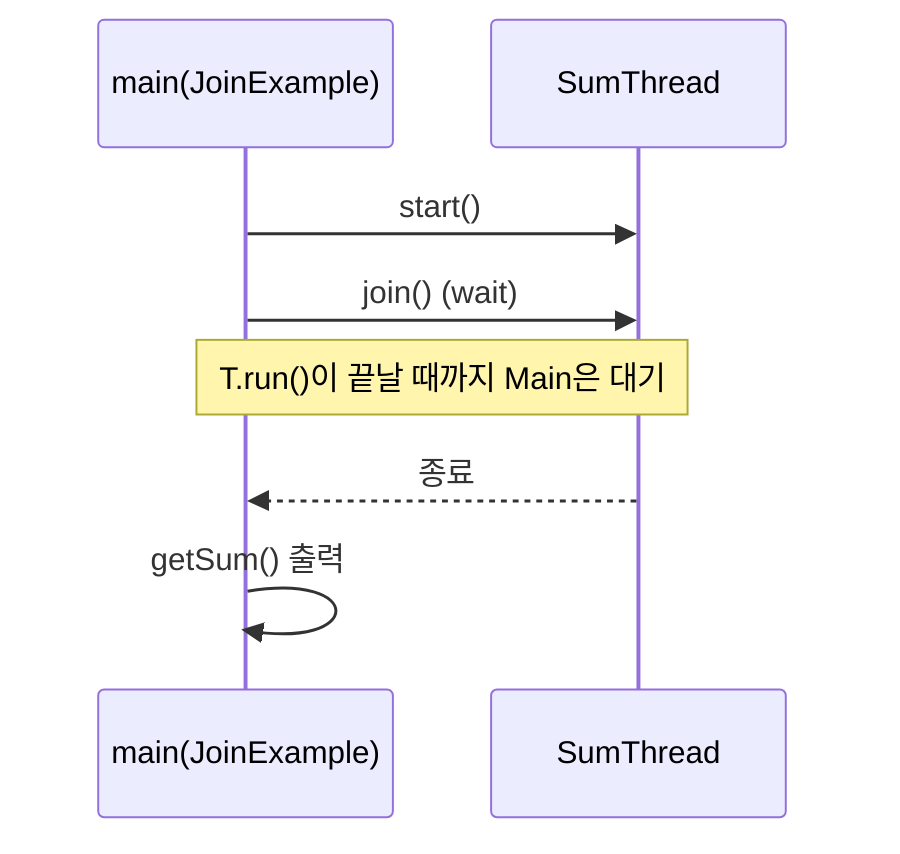

# day9-thread (dyay9-thread)

자바 **스레드(Thread)** 기초와 **TCP 소켓 서버/클라이언트**에서의 동시성 처리 흐름을 예제로 정리한 프로젝트입니다.

---

## 핵심 개념 한 장 요약

- **Thread 생성/실행**
  - `Thread`를 상속해 `run()`에 동작을 작성하고, `start()`로 실행합니다.
  - `run()`을 직접 호출하면 “그냥 메서드 호출”이고, `start()`가 진짜 멀티스레드 실행을 시작합니다.
- **sleep / InterruptedException**
  - `Thread.sleep(ms)`는 현재 스레드를 잠깐 멈춥니다.
  - 외부 요인으로 중단될 수 있어 `InterruptedException` 처리가 필요합니다.
- **join**
  - `join()`은 **대상 스레드가 끝날 때까지 현재 스레드가 대기**합니다.
  - “결과가 계산될 때까지 기다려야 하는 상황”에 사용합니다.
- **동기화(synchronized)**
  - 여러 스레드가 공유 데이터(예: `balance`)를 동시에 변경하면 **경쟁 상태(race condition)** 가 생깁니다.
  - `synchronized`로 임계 구역을 보호하면 한 번에 한 스레드만 접근하게 되어 일관성이 좋아집니다.
- **TCP 서버의 동시성**
  - `ServerSocket.accept()`는 클라이언트 연결이 올 때까지 블로킹됩니다.
  - 서버가 연결 처리(또는 작업)를 오래 잡고 있으면 다음 연결을 못 받으므로, **연결당 스레드** 또는 **스레드풀** 같은 구조가 필요합니다.

---

## 실행 흐름 그림(mermaid)

### 1) 기본 Thread 실행 흐름 (`ThreadUser` → `Thread1`,`Thread2`)

```mermaid
flowchart LR
  M[main: ThreadUser] --> A[new Thread1()]
  M --> B[new Thread2()]
  M -->|setName| A
  M -->|setName| B
  M -->|start| A
  M -->|start| B
  A -->|run loop + sleep| OUT1[(println)]
  B -->|run loop + sleep| OUT2[(println)]
```

### 2) join으로 “끝날 때까지 기다리기” (`JoinExample` → `SumThread`)



### 3) 동기화 전/후 차이 (`SyncTest`/`SyncTest2`)

```mermaid
flowchart TB
  subgraph NoSync[동기화 없음 (BankAccount)]
    T1[Thread-1] --> W1[withdraw(400)]
    T2[Thread-2] --> W1
    W1 -->|동시에 balance 갱신 가능| RACE[Race condition 위험]
  end

  subgraph Sync[동기화 있음 (BankAccount2)]
    S1[Thread-1] --> SW[ synchronized withdraw(400) ]
    S2[Thread-2] --> SW
    SW -->|한 번에 한 스레드만| SAFE[일관성 증가]
  end
```

### 4) TCP 서버: 단일 처리 vs 연결당 스레드 (`TCPServer` vs `TCPServer2`)

```mermaid
flowchart LR
  C1[Client] -->|connect| ACC1[accept()]
  C2[Client] -->|connect| ACC1
  C3[Client] -->|connect| ACC1

  subgraph S1[단순 서버 (TCPServer)]
    ACC1 --> ONE[main thread가 처리]
    ONE --> NEXT[다음 accept 대기]
  end

  subgraph S2[스레드 서버 (TCPServer2)]
    ACC2[accept()] --> SPawn[새 Thread 생성]
    SPawn --> Work[연결 처리/대기 후 close]
    ACC2 --> SPawn
  end
```

---

## 코드별 설명

### `Thread1.java`
- `Thread`를 상속하고 `run()`에서 **0부터 증가**하며 출력합니다.
- 매 반복마다 `Thread.sleep(1000)`으로 1초 대기합니다.

### `Thread2.java`
- `Thread`를 상속하고 `run()`에서 **10000부터 감소**하며 출력합니다.
- `Thread1`과 동시에 돌면 출력이 서로 섞이는 것이 “동시 실행”의 체감 포인트입니다.

### `ThreadUser.java`
- `Thread1`, `Thread2` 객체를 만들고 `setName()`으로 이름을 지정한 뒤 `start()`합니다.
- 포인트: `start()` 호출 순서와 스케줄링은 다르며, 실제 실행 순서는 OS/VM 스케줄러에 따라 달라질 수 있습니다.

### `SumThread.java`
- `run()`에서 1~100 합을 누적하고, 결과는 `getSum()`으로 조회합니다.

### `JoinExample.java`
- `SumThread.start()` 이후 `join()`을 호출해 **계산이 끝날 때까지 기다린 다음** 합계를 출력합니다.
- 파일 하단 주석처럼 `join()`이 없으면 `getSum()`이 0처럼 “아직 계산 전 값”일 수 있습니다.

### `BankAccount.java` + `SyncTest.java`
- `balance`를 공유하면서 `withdraw()`에서 잔액 검사 후 차감합니다.
- 동기화가 없어서 **둘이 동시에 검사/차감**하면 출력 순서와 잔액 결과가 섞여 보일 수 있습니다(경쟁 상태).

### `BankAccount2.java` + `SyncTest2.java`
- `withdraw()`에 `synchronized`를 붙여 **한 번에 하나의 스레드만** 출금 로직에 들어오게 합니다.
- 결과적으로 로그가 더 “순차적으로” 보이며, 공유 데이터 일관성이 좋아집니다.

### `TCPServer.java`
- `ServerSocket(9100)`을 열고 무한 루프로 `accept()`하여 연결을 받습니다.
- 연결만 “승인”하고 별도의 작업은 하지 않지만, 구조상 메인 스레드가 계속 accept/카운트만 담당합니다.

### `TCPClients.java`
- 루프를 돌며 `localhost:9100`에 연결을 시도합니다.
- 주의: 연결 후 `close()`가 없어서 소켓이 많이 쌓일 수 있습니다(학습용 예제라면 테스트 횟수를 줄이거나 종료 처리를 권장).

### `TCPServer2.java`
- `accept()`로 연결을 받으면 **익명 스레드(람다)** 를 만들어 그 안에서 연결 처리 후 `socket.close()`합니다.
- 포인트: “연결당 스레드” 패턴의 최소 형태입니다(실무에선 보통 스레드풀 사용).

### `TCPClients2.java`
- 클라이언트 1000개를 각각 새 스레드로 만들어 접속 후 `close()`합니다.
- 포인트: 클라이언트도 동시에 접속을 만들 수 있지만, 스레드 수가 너무 많아지면 자원 문제가 생길 수 있습니다.

---

## 어떻게 실행하나요?

### IntelliJ IDEA 기준
- `dyay9-thread/src/thread`의 각 클래스에 `main`이 있는 파일을 선택해서 실행합니다.
  - Thread 예제: `ThreadUser`
  - join 예제: `JoinExample`
  - 동기화 예제: `SyncTest`, `SyncTest2`
  - TCP 예제: 먼저 `TCPServer` 또는 `TCPServer2` 실행 → 그 다음 `TCPClients` 또는 `TCPClients2` 실행

---

## 표로 정리(한눈에 보기)

| 구분 | 파일 | 주제 | 핵심 API/키워드 | 관찰 포인트 |
|---|---|---|---|---|
| Thread 기본 | `Thread1` | 증가 루프 스레드 | `Thread`, `run`, `sleep` | 출력이 다른 스레드와 섞임 |
| Thread 기본 | `Thread2` | 감소 루프 스레드 | `Thread`, `run`, `sleep` | 스케줄링으로 실행 순서가 매번 다를 수 있음 |
| Thread 기본 | `ThreadUser` | 스레드 실행자 | `start`, `setName` | `start()`가 멀티스레드 시작 |
| join | `SumThread` | 합 계산 스레드 | `run`, getter | 작업 결과를 스레드가 계산 |
| join | `JoinExample` | 완료 대기 | `join` | `join()` 없으면 결과가 아직 0일 수 있음 |
| 동기화 X | `BankAccount` + `SyncTest` | 경쟁 상태 예시 | 공유 변수, 조건검사-차감 | 잔액/로그가 섞이며 일관성 깨질 수 있음 |
| 동기화 O | `BankAccount2` + `SyncTest2` | 임계구역 보호 | `synchronized` | 한 번에 한 스레드만 출금 |
| TCP 서버(단순) | `TCPServer` | 연결 수락 | `ServerSocket`, `accept` | accept는 블로킹, 서버는 연결 카운트 |
| TCP 클라이언트(단순) | `TCPClients` | 대량 접속 | `Socket` | 종료 처리 없으면 자원 누수 위험 |
| TCP 서버(스레드) | `TCPServer2` | 연결당 스레드 | `new Thread(() -> ...)` | 동시 연결 처리의 기본 형태 |
| TCP 클라이언트(스레드) | `TCPClients2` | 클라 동시 접속 | 클라 측 스레드 생성 | 스레드 과다 생성은 부담 |

