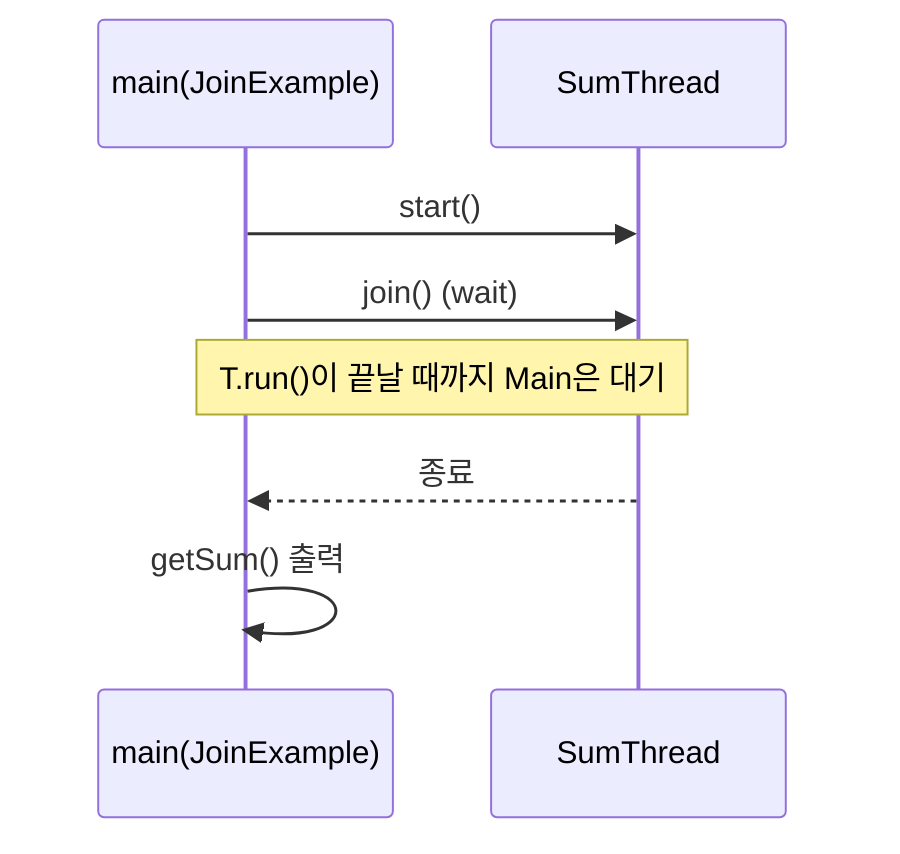

# day9-thread (dyay9-thread)

자바 **스레드(Thread)** 기초와 **TCP 소켓 서버/클라이언트**에서의 동시성 처리 흐름을 예제로 정리한 프로젝트입니다.

---

## 핵심 개념 한 장 요약

- **Thread 생성/실행**
  - `Thread`를 상속해 `run()`에 동작을 작성하고, `start()`로 실행합니다.
  - `run()`을 직접 호출하면 “그냥 메서드 호출”이고, `start()`가 진짜 멀티스레드 실행을 시작합니다.
- **sleep / InterruptedException**
  - `Thread.sleep(ms)`는 현재 스레드를 잠깐 멈춥니다.
  - 외부 요인으로 중단될 수 있어 `InterruptedException` 처리가 필요합니다.
- **join**
  - `join()`은 **대상 스레드가 끝날 때까지 현재 스레드가 대기**합니다.
  - “결과가 계산될 때까지 기다려야 하는 상황”에 사용합니다.
- **동기화(synchronized)**
  - 여러 스레드가 공유 데이터(예: `balance`)를 동시에 변경하면 **경쟁 상태(race condition)** 가 생깁니다.
  - `synchronized`로 임계 구역을 보호하면 한 번에 한 스레드만 접근하게 되어 일관성이 좋아집니다.
- **TCP 서버의 동시성**
  - `ServerSocket.accept()`는 클라이언트 연결이 올 때까지 블로킹됩니다.
  - 서버가 연결 처리(또는 작업)를 오래 잡고 있으면 다음 연결을 못 받으므로, **연결당 스레드** 또는 **스레드풀** 같은 구조가 필요합니다.

---

## 실행 흐름 그림(mermaid)

### 1) 기본 Thread 실행 흐름 (`ThreadUser` → `Thread1`,`Thread2`)

```mermaid
flowchart TB
  M[ThreadUser.main] --> A[Thread1]
  M --> B[Thread2]
  M -->|start()| A
  M -->|start()| B
  A --> OUT1[출력 + sleep]
  B --> OUT2[출력 + sleep]
```

### 2) join으로 “끝날 때까지 기다리기” (`JoinExample` → `SumThread`)



### 3) 동기화 전/후 차이 (`SyncTest`/`SyncTest2`)

```mermaid
flowchart TB
  subgraph NoSync[동기화 없음 (BankAccount)]
    T1[Thread-1] --> W1[withdraw(400)]
    T2[Thread-2] --> W1
    W1 -->|동시에 balance 갱신 가능| RACE[Race condition 위험]
  end

  subgraph Sync[동기화 있음 (BankAccount2)]
    S1[Thread-1] --> SW[ synchronized withdraw(400) ]
    S2[Thread-2] --> SW
    SW -->|한 번에 한 스레드만| SAFE[일관성 증가]
  end
```

### 4) TCP 서버: 단일 처리 vs 연결당 스레드 (`TCPServer` vs `TCPServer2`)

```mermaid
flowchart TB
  subgraph S1[TCPServer: 단일 흐름]
    ACC1[accept()] --> LOG1[카운트/로그]
    LOG1 --> ACC1
  end

  subgraph S2[TCPServer2: 연결당 스레드]
    ACC2[accept()] --> SPAWN[Thread 생성]
    SPAWN --> WORK[처리 후 socket.close()]
    ACC2 --> SPAWN
  end
```

---

## 코드 + 설명 (코드 아래에 바로 해설)

### `Thread1.java`

```java
package thread;

//1. 스레드 클래스를 만드세요. 1) 이름클래스 2) 익명클래스
public class Thread1 extends Thread{
    @Override
    public void run() {
        //동시에 처리되는 코드
        for (int i = 0; i < 10000; i++) {
            System.out.println("++ 증가: " + i);
            System.out.println("스레드 이름: " + Thread.currentThread().getName());
            try {
                Thread.sleep(1000);
            } catch (InterruptedException e) {
                System.out.println("에러정보 "  + e);
            }
        }
    }
}
```

- **핵심**: `run()` 안의 루프가 “동시에 실행”되는 작업입니다.
- **관찰**: `Thread.sleep(1000)` 때문에 1초마다 출력이 나오며, 다른 스레드 출력과 섞입니다.
- **포인트**: 실행 중인 스레드 이름은 `Thread.currentThread().getName()`으로 확인합니다.

### `Thread2.java`

```java
package thread;

//1. 스레드 클래스를 만드세요. 1) 이름클래스 2) 익명클래스
public class Thread2 extends Thread{
    @Override
    public void run() {
        //동시에 처리되는 코드
        for (int i = 10000; i > 0; i--) {
            System.out.println("-- 감소: " + i);
            //스레드 이름은 start순서에 따라 Thread1, Thread2 이렇게 자동으로 이름이 만들어짐.
            System.out.println("스레드 이름: " + Thread.currentThread().getName());
            try {
                Thread.sleep(1000);
            } catch (InterruptedException e) {
                System.out.println("에러정보 "  + e);
            }
        }
    }
}
```

- **핵심**: `Thread1`과 반대로 감소 루프를 돌며 출력합니다.
- **관찰**: 동시에 실행되므로 `Thread1`과 `Thread2`의 출력이 서로 섞여 보입니다.

### `ThreadUser.java`

```java
package thread;

public class ThreadUser {
    public static void main(String[] args) {
        //1. thread클래스를 만들자.
        //2. 객체를 만들자.
        Thread thread1 = new Thread1();
        Thread thread2 = new Thread2();
        //스레드 이름은 start순서에 따라 Thread1, Thread2 이렇게 자동으로 이름이 만들어짐.
        thread1.setName("증가 스레드"); //스레드 이름을 임의로 지정할 수 있음.
        thread2.setName("감소 스레드"); //스레드 이름을 임의로 지정할 수 있음.
        //3. cpu대기줄에 넣자.
        thread1.start();
        thread2.start();
    }
}
```

- **핵심**: `start()` 호출로 각 스레드의 `run()`이 별도 실행됩니다.
- **중요**: `start()`를 호출하는 “순서”가 실제 출력 순서를 보장하지는 않습니다(스케줄링은 JVM/OS가 결정).
- **팁**: `setName()`으로 이름을 붙이면 로그에서 어떤 스레드인지 구분하기 쉬워요.

### `SumThread.java`

```java
package thread;

public class SumThread extends Thread {
    private long sum;

    public long getSum() {
        return sum;
    }

    public void setSum(long sum) {
        this.sum = sum;
    }

    @Override
    public void run() {
        for (int i = 1; i <= 100; i++) {
            sum += i;
        }
    }
}
```

- **핵심**: 계산 결과(`sum`)가 스레드 내부에서 만들어지고, 메인 스레드는 `getSum()`으로 조회합니다.

### `JoinExample.java`

```java
package thread;

public class JoinExample {
    public static void main(String[] args) {
        SumThread sumThread = new SumThread();
        sumThread.start();
        try {
            sumThread.join();
        } catch (InterruptedException e) {
        }
        System.out.println("1~100 합: " + sumThread.getSum());
    }
}

//join은 해당 스레드가 끝날 때 까지 기다리는 기능
//join()안했을 때
//1~100 합: 0
//합을 다 구해야 프린트 가능함.
//join()넣어줬을 때
//1~100 합: 5050
```

- **핵심**: `join()` 때문에 `sumThread`가 끝나기 전에는 다음 줄(출력)로 못 넘어갑니다.
- **왜 필요?**: `join()`이 없으면 메인 스레드가 먼저 `getSum()`을 찍어 “아직 0”일 수 있습니다.

### `BankAccount.java` + `SyncTest.java` (동기화 없음)

```java
package thread;

class BankAccount extends Thread {
    private int balance = 1000;
    public void withdraw(int amount) {
        if (balance >= amount) {
            System.out.println(Thread.currentThread().getName() + " 출금 시도 중...");
            balance -= amount;
            System.out.println(Thread.currentThread().getName() + " 출금 완료. 남은 잔액: " + balance);
        } else {
            System.out.println(Thread.currentThread().getName() + " 출금 실패. 잔액 부족.");
        }
    }
    @Override
    public void run() {
        for (int i = 0; i < 3; i++) {
            withdraw(400);
        }
    }
}
```

```java
package thread;

public class SyncTest {
    public static void main(String[] args) {
        BankAccount bankAccount = new BankAccount();
        Thread t1 = new Thread(bankAccount);
        Thread t2 = new Thread(bankAccount);
        t1.start();
        t2.start();
    }
}
```

- **핵심**: 두 스레드가 같은 `BankAccount`(같은 `balance`)를 공유합니다.
- **문제**: 잔액 검사(`if`)와 차감(`balance -= amount`) 사이에 다른 스레드가 끼어들면 결과/로그가 기대와 다르게 보일 수 있어요(경쟁 상태).

### `BankAccount2.java` + `SyncTest2.java` (synchronized)

```java
package thread;

class BankAccount2 extends Thread {
    private int balance = 1000;
    public synchronized void withdraw(int amount) {
        if (balance >= amount) {
            System.out.println(Thread.currentThread().getName() + " 출금 시도 중...");
            balance -= amount;
            System.out.println(Thread.currentThread().getName() + " 출금 완료. 남은 잔액: " + balance);
        } else {
            System.out.println(Thread.currentThread().getName() + " 출금 실패. 잔액 부족.");
        }
    }
    @Override
    public void run() {
        for (int i = 0; i < 3; i++) {
            withdraw(400);
        }
    }
}
```

```java
package thread;

public class SyncTest2 {
    public static void main(String[] args) {
        BankAccount2 bankAccount = new BankAccount2();
        Thread t1 = new Thread(bankAccount);
        Thread t2 = new Thread(bankAccount);
        t1.start();
        t2.start();
    }
}
```

- **핵심**: `synchronized`가 붙은 `withdraw()`는 한 번에 한 스레드만 들어올 수 있습니다.
- **효과**: 공유 데이터(`balance`) 동시 접근이 줄어, 결과가 더 안정적으로 보입니다.

### `TCPServer.java` (단순 서버)

```java
package thread;

import java.net.ServerSocket;
import java.net.Socket;

public class TCPServer {
    public static void main(String[] args) throws Exception {
// Socket이 2개 필요
// 클라이언트 연결 승인용: ServerSocket
// 데이터 전송용: Socket
// 예외처리: 외부의 자원을 연결하는 경우 (db, file, net, CPU)
        ServerSocket server = new ServerSocket(9100);
        System.out.println("TCP 서버 소켓 시작됨.");
        System.out.println("클라이언트의 연결을 기다리는 중...");
        int count = 0;
        while (true) {
            Socket socket = server.accept(); // 클라이언트 연결 수락
            count++;
            System.out.println("연결된 클라이언트 수: " + count);
            System.out.println("클라이언트와 연결 성공.");
        }
    }
}
```

- **핵심**: `accept()`는 연결이 올 때까지 기다리는(블로킹) 함수입니다.
- **주의**: 이 코드는 `socket.close()`를 하지 않아서 연결이 계속 쌓일 수 있습니다(실습할 땐 횟수 줄이기 권장).

### `TCPClients.java` (단순 클라이언트)

```java
package thread;

import java.net.Socket;

public class TCPClients {
    public static void main(String[] args) throws Exception {
        for (int i = 0; i < 10000; i++) {
            Socket socket = new Socket("localhost", 9100);
            System.out.println("클라이언트 " + i + ": 서버와 연결성공!!!!");
        }
    }
}
```

- **핵심**: 클라이언트가 루프로 서버에 계속 접속합니다.
- **주의**: `socket.close()`가 없어서 소켓 자원을 많이 씁니다.

### `TCPServer2.java` (연결당 스레드)

```java
package thread;

import java.net.ServerSocket;
import java.net.Socket;

public class TCPServer2 {
    public static void main(String[] args) throws Exception {

        ServerSocket server = new ServerSocket(9100);
        System.out.println("TCP 서버 시작");

        while (true) {
            Socket socket = server.accept(); // 연결 수락

            // 👉 핵심: 스레드 생성
            new Thread(() -> {
                try {
                    System.out.println(Thread.currentThread().getName()
                            + " : 클라이언트 연결됨");

                    // 간단 유지 (테스트용)
                    Thread.sleep(1000);

                    socket.close();
                } catch (Exception e) {
                    e.printStackTrace();
                }
            }).start(); // 바로 실행
        }
    }
}
```

- **핵심**: 연결이 들어올 때마다 새 스레드를 만들어 그 스레드가 처리합니다.
- **효과**: 메인 스레드는 다음 연결을 계속 받을 수 있습니다.

### `TCPClients2.java` (클라이언트도 스레드로 동시 접속)

```java
package thread;

import java.net.Socket;

public class TCPClients2 {
    public static void main(String[] args) {

        for (int i = 0; i < 1000; i++) {
            int clientNo = i;

            new Thread(() -> {
                try {
                    Socket socket = new Socket("localhost", 9100);
                    System.out.println("클라이언트 " + clientNo + ": 서버와 연결성공!!!!");
                    socket.close();
                } catch (Exception e) {
                    e.printStackTrace();
                }
            }).start();
        }
    }
}
```

- **핵심**: 클라이언트도 스레드를 사용해 동시에 접속을 만듭니다.
- **주의**: 스레드를 너무 많이 만들면 PC가 느려질 수 있습니다.

---

## 어떻게 실행하나요?

### IntelliJ IDEA 기준
- `dyay9-thread/src/thread`의 각 클래스에 `main`이 있는 파일을 선택해서 실행합니다.
  - Thread 예제: `ThreadUser`
  - join 예제: `JoinExample`
  - 동기화 예제: `SyncTest`, `SyncTest2`
  - TCP 예제: 먼저 `TCPServer` 또는 `TCPServer2` 실행 → 그 다음 `TCPClients` 또는 `TCPClients2` 실행

---

## 표로 정리(한눈에 보기)

| 구분 | 파일 | 주제 | 핵심 API/키워드 | 관찰 포인트 |
|---|---|---|---|---|
| Thread 기본 | `Thread1` | 증가 루프 스레드 | `Thread`, `run`, `sleep` | 출력이 다른 스레드와 섞임 |
| Thread 기본 | `Thread2` | 감소 루프 스레드 | `Thread`, `run`, `sleep` | 스케줄링으로 실행 순서가 매번 다를 수 있음 |
| Thread 기본 | `ThreadUser` | 스레드 실행자 | `start`, `setName` | `start()`가 멀티스레드 시작 |
| join | `SumThread` | 합 계산 스레드 | `run`, getter | 작업 결과를 스레드가 계산 |
| join | `JoinExample` | 완료 대기 | `join` | `join()` 없으면 결과가 아직 0일 수 있음 |
| 동기화 X | `BankAccount` + `SyncTest` | 경쟁 상태 예시 | 공유 변수, 조건검사-차감 | 잔액/로그가 섞이며 일관성 깨질 수 있음 |
| 동기화 O | `BankAccount2` + `SyncTest2` | 임계구역 보호 | `synchronized` | 한 번에 한 스레드만 출금 |
| TCP 서버(단순) | `TCPServer` | 연결 수락 | `ServerSocket`, `accept` | accept는 블로킹, 서버는 연결 카운트 |
| TCP 클라이언트(단순) | `TCPClients` | 대량 접속 | `Socket` | 종료 처리 없으면 자원 누수 위험 |
| TCP 서버(스레드) | `TCPServer2` | 연결당 스레드 | `new Thread(() -> ...)` | 동시 연결 처리의 기본 형태 |
| TCP 클라이언트(스레드) | `TCPClients2` | 클라 동시 접속 | 클라 측 스레드 생성 | 스레드 과다 생성은 부담 |

